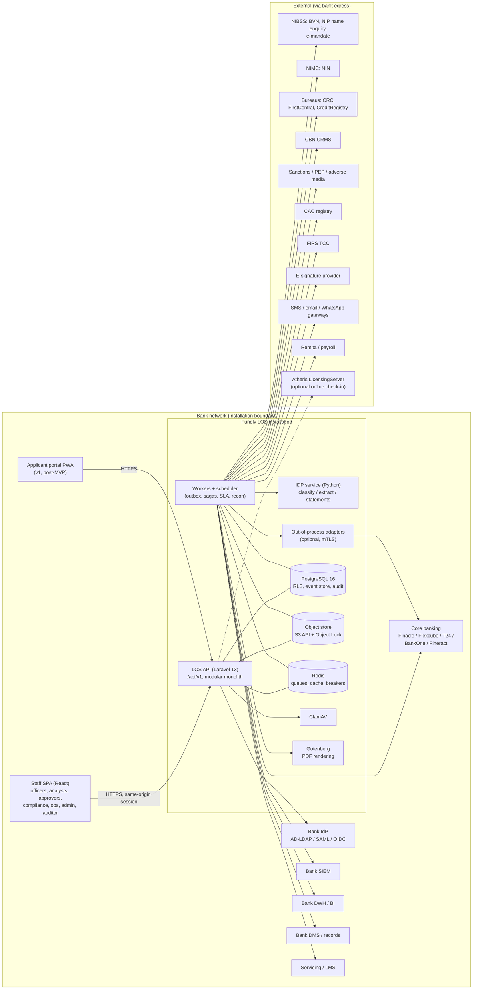
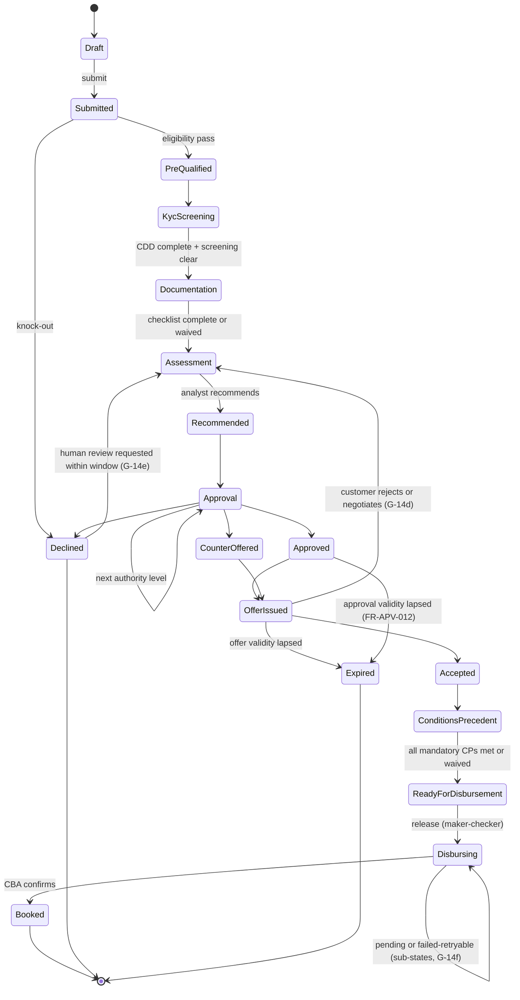

# 03 — Technical Requirements Document (TRD)

| | |
|---|---|
| **Product** | Fundly LOS (working name, D-028) |
| **Version** | 1.0, 8 October 2026 |
| **Baseline** | BRD v0.1 + `01-requirements-inventory` + `02-gap-register` + `decision-log` (D-001 to D-036) |
| **Audience** | Bank CTO / IT architecture, InfoSec, Credit Risk, Internal Audit, and the build agents |
| **Status** | Issued for build. Changes go through the decision log. |

**Conventions.** Requirements are cited by their **BRD ID** (e.g. FR-CBA-002), which is unique and carried unchanged in the inventory. Requirements without a BRD ID are cited by **LOS ID** (LOS-FR-274 onward, LOS-CON-nnn). `08-traceability-matrix` maps every ID to its LOS ID, module, task and test. **[MVP]** marks items delivered in the MVP release (D-036); everything else lands in a later v1 phase per `06-development-plan.md`. **[verify]** marks regulatory statements that must be confirmed against a primary source before the corresponding pack rule is activated (see §9.4).

---

## 1. System overview and context

### 1.1 What the system is
Fundly LOS is a **bank-installed** loan origination platform. It runs on-prem or in the bank's private cloud and is licensed per installation (D-030). It owns the origination journey, from lead to booked facility, and reaches the core banking application (CBA) and every other external service only through versioned ports and pluggable adapters (BRD §9, FR-CBA-001..020).

### 1.2 Context diagram



All arrows to external systems go through the **Integration Runtime** (§4.17). No module calls a vendor SDK directly; this is enforced by an architectural test (FR-CBA-002).

### 1.3 Actors
These are the BRD §6 personas, mapped to the standard role library (LOS-FR-278):

| Actor | Primary roles |
|---|---|
| Relationship manager / loan officer | Loan Officer / RM |
| Branch operations | Documentation Officer, Branch Manager |
| Credit analyst | Credit Analyst, Senior Credit Analyst |
| Approver / committee | Credit Approver (tiered), Credit Committee Member |
| Compliance | Compliance Officer, AML Analyst |
| Legal | Legal Officer, Collateral Officer |
| Disbursement | Disbursement Maker, Disbursement Checker |
| Product | Product Manager |
| Administrator | Tenant Administrator |
| Assurance | Auditor, Regulator/Examiner |
| Partner | Partner/DSA |
| Vendor | Platform Operator (licence and support only, D-030) |
| System | Named system identities, e.g. `system:rules-engine`, `system:outbox` (FR-AUD-005) |

---

## 2. Architecture

### 2.1 Style: modular monolith plus three satellite services

| Deployable | Technology | Why it is separate |
|---|---|---|
| **LOS core** (API, workers, scheduler) | Laravel 13, PHP 8.3+ | One transactional boundary for the application aggregate, approvals and the audit trail |
| **IDP service** | Python 3.12, FastAPI, OCR and layout models | ML ecosystem; GPU/CPU scaling independent of the API (D-006) |
| **Out-of-process adapters** (optional) | Any language; canonical contract over HTTPS + mTLS | Hot-swap without core redeploy and bank-built adapters (FR-CBA-018, FR-CBA-014; D-019) |
| **Gotenberg** | Off-the-shelf container | Faithful HTML-to-PDF rendering for offers and agreements, with no outbound calls |

**Why not microservices.**
- Origination is one consistency domain. Approval, the decision snapshot, the audit event and the outbox message have to commit together.
- Splitting them would force distributed transactions or eventual consistency onto exactly the controls an examiner tests.
- A bank operations team also runs this on-prem, so fewer moving parts means fewer failed installations.

**Keeping the monolith honest.** Module boundaries are enforced in CI (Deptrac):
- A module may call another module only through that module's `Contracts` namespace, which holds its public application services and DTOs.
- Cross-module side effects flow through domain events.

The monolith can therefore be split later if a bank needs a module scaled independently.

### 2.2 Code layout

```
fundly-los/
  backend/                      Laravel 13 application
    app/                        framework glue only (providers, kernel, exceptions)
    src/
      Shared/                   kernel: Money, IDs, Clock, Tenancy, Audit, Idempotency, Outbox, Rules evaluator
      Modules/<Module>/
        Contracts/              public interfaces + DTOs (the only thing other modules may import)
        Domain/                 entities, value objects, domain events, policies (no Laravel imports)
        Application/            commands, queries, handlers (use cases)
        Infrastructure/         Eloquent models, repositories, migrations
        Http/                   controllers, form requests, API resources (thin)
      Integration/
        Ports/                  canonical interfaces (CoreBanking, Bureau, Identity, Screening, ...)
        Runtime/                registry, manifest, outbox dispatcher, retry, breaker, saga, error taxonomy
        Adapters/<Vendor>/      the ONLY place vendor identifiers may appear
        Simulators/             mock CBA and mock providers with failure/latency injection
    database/migrations/        ordered per module
    tests/{Unit,Feature,Architecture,Contract,Certification}
  frontend/                     React 19 + TypeScript + Vite SPA
    src/{app,components,features/<module>,api(generated),design-tokens}
  idp/                          Python IDP service
  api/openapi/                  OpenAPI 3.1 source of truth (split files) + Spectral ruleset
  deploy/{docker,compose,helm,ansible,airgap}
  docs/
```

### 2.3 Multi-tenancy (D-033)

| Concern | Design |
|---|---|
| Tenant | One per installation by default. A `tenants` table and `tenant_id` column on every tenant-owned table are kept, so FR-TEN-001/002 hold structurally. |
| Isolation | Application layer: the global `TenantScope` on every model, plus the tenant resolved from the authenticated principal and never from the request body. Database layer: **PostgreSQL RLS** with `FORCE ROW LEVEL SECURITY` and policy `tenant_id = current_setting('app.tenant_id')::uuid`. The app connects as a non-owner role, so RLS cannot be bypassed by the app. `SET LOCAL app.tenant_id` runs per transaction, for requests and jobs. |
| Dedicated isolation (FR-TEN-002) | Schema-per-tenant or database-per-tenant via connection resolver. It is configured, not coded, and only relevant to a future SaaS edition. |
| Legal entities | `legal_entities` under a tenant. Each one resolves its jurisdiction pack (Nigeria × commercial bank), base currency and prudential parameters (LOS-FR-307). |
| Org hierarchy | `org_units` as an adjacency list with a closure table, with configurable depth and labels (FR-TEN-003). The closure table makes subtree scope checks O(1) joins. |

### 2.4 Deployment profiles (D-030, G-50)

| Profile | Topology | Use | Meets NFR-005/007/008? |
|---|---|---|---|
| **Single-node** | One VM, docker-compose: api, worker, scheduler, nginx, postgres, redis, minio, clamav, gotenberg, idp | Demo, UAT, pilot | **No.** Labelled as such in the installation qualification. |
| **HA reference** | ≥2 app VMs (api + worker) behind the bank LB; PostgreSQL primary + **synchronous** standby (Patroni) + async DR replica; Redis Sentinel (3); MinIO 4-node erasure set with Object Lock; IDP on a separate node (GPU optional) | Production | **Yes**, when the bank provides the topology. Certified by the vendor DR test. |
| **Kubernetes** | Helm chart; same components; bank-managed PostgreSQL allowed if it supports sync replication + PITR | Banks with an OpenShift/K8s estate | Yes |

**Artefacts (one per release; PR-10, NFR-009).**
- Signed OCI images (cosign).
- Helm chart, compose files and Ansible roles.
- SBOM (CycloneDX).
- Migration bundle.
- Release notes.

All of these are packed into a signed **offline bundle** for air-gapped sites (G-52). **Zero-downtime upgrade (NFR-010)** uses expand/contract migrations only (no destructive DDL in the same release that stops using a column) and rolling restart of app nodes.

### 2.5 Air-gapped update channel (G-52)
Five artefact types arrive as signed files and are imported through the admin console with maker-checker:
1. Release bundle.
2. Licence file.
3. Watchlist snapshot.
4. Jurisdiction pack version.
5. Extension module.

Signatures are verified against vendor public keys pinned in the installation. Every import is an audit event.

### 2.6 Licensing (D-034)
- **`LicensingPort`** provides:
  - `currentLicence(): Licence`
  - `checkIn(): CheckInResult` (optional online)
  - `activate(offlineRequest): ActivationResponse`
- **The licence** is a JSON document signed with Ed25519, containing:
  - `licence_id`, `client`, `installation_fingerprint` (hash of installation UUID + DB system identifier)
  - `edition`, `modules[]`, `max_named_users`, `max_legal_entities`, `adapter_entitlements[]`
  - `valid_from`, `valid_to`, `grace_days`, `support_tier`
- **Adapters:**
  - `OfflineSignedFileLicensing` **[MVP]**.
  - `AtherisLicensingServer` (pending G-48).
- **Enforcement points:**
  - Login (named-user cap).
  - Module route groups (module entitlement).
  - Adapter activation.
  - Application creation (validity).
- **Fail-safe rules (D-034).** Never blocked by licence state:
  - In-flight sagas and reconciliation.
  - Auditor and regulator read access and evidence export.
  - Data subject requests.
- **Warnings.** Licence events (expiry warnings at T-60, T-30, T-7, entering grace, breach) are raised to tenant admins and audit-logged.

### 2.7 Release and branching (D-035)
- One mainline with trunk-based development, short-lived feature branches and semver tags.
- Client-specific behaviour lives only in configuration (§17 layers 1–4), adapters (layer 5) or signed **extension modules** (layer 6). An extension module is a versioned Composer package that implements declared extension points and is loaded only if the licence entitles it.
- There are no client branches.

---

## 3. Technology stack

| Layer | Choice | Version policy | Notes and justification |
|---|---|---|---|
| Language/runtime | PHP | 8.3+ (8.4 supported) | Laravel 13 minimum is 8.3 |
| Framework | **Laravel 13** | 13.x latest at release; tracked monthly | D-016. Laravel 11 is out of support (G-17). |
| API auth | Laravel Sanctum (SPA cookie + scoped tokens) | | D-031, G-51 |
| Database | **PostgreSQL 16+** | | D-017. RLS, JSONB, partitioning, pg_trgm. |
| Queue/cache | Redis 7 + Laravel Horizon | | Breaker state, rate limits, idempotency fast-path |
| Object storage | S3 API (MinIO on-prem) with Object Lock (compliance mode) | | FR-DOC-005, FR-AUD-013 |
| Malware scan | ClamAV (clamd) | Signature updates via bank mirror or offline bundle | FR-DOC-004 |
| PDF | Gotenberg (Chromium) | | Offer letters, agreements, evidence pack index |
| Rules expressions | `symfony/expression-language` in a restricted sandbox (whitelisted functions only) | Evaluator version pinned per decision | D-020 |
| PII crypto | libsodium (XChaCha20-Poly1305) envelope encryption; per-tenant DEK wrapped by KEK in a `KeyManagementPort` (local keyfile **[MVP]**, HashiCorp Vault Transit, PKCS#11 HSM) | | FR-SEC-016/017 |
| Frontend | React 19, TypeScript 5, Vite, TanStack Query, React Router, React Hook Form + Zod, Tailwind CSS (tokens from the design brief) | | D-031. AuditPro components ported to TS. |
| API client | Generated from OpenAPI (openapi-typescript + openapi-fetch) | | Contract drift fails the build |
| IDP | Python 3.12, FastAPI, PaddleOCR/Tesseract, layout model, rules for statements | | D-006 |
| Observability | OpenTelemetry (PHP + Python SDKs) → OTLP collector; Monolog JSON; Prometheus metrics; health/readiness endpoints | | NFR-011 |
| Static analysis | Larastan (PHPStan level 8), Pint, Deptrac, ESLint, tsc strict, Ruff, mypy | | |
| Tests | Pest (PHP), Vitest + Testing Library, Playwright, pytest, k6 (load) | | §12 |
| Security tooling | Semgrep, composer/npm/pip audit, Trivy, Gitleaks, OWASP ZAP baseline | | §8 |
| CI/CD | Existing Atheris pipeline (GitHub Actions), extended with the stages in §13 | | Brief: deviate only with justification |

**Deviations from the house stack, with justification:**
- **No Inertia** (PO decision D-031).
- **PostgreSQL rather than MySQL** (D-017).
- **A Python service for IDP** (D-006): no credible PHP ML/OCR ecosystem.
- **Gotenberg for PDF**: PHP PDF libraries cannot render the bank-grade agreement templates faithfully.

---

## 4. Module breakdown

Every module follows the layout in §2.2. "Owns" means that module alone writes the table. The MVP column summarises scope; the per-requirement phase is in `08-traceability-matrix`.

| # | Module (namespace) | BRD requirements | Owns (key tables) | MVP scope |
|---|---|---|---|---|
| M01 | **Platform** (`Platform`): tenancy, org, reference data, configuration lifecycle | FR-TEN-001..011, FR-CFG-001..004, LOS-FR-284, LOS-FR-307, LOS-FR-310 | tenants, legal_entities, org_units(+closure), reference_lists, calendars, fx_rates, config_artifacts, config_versions, prudential_parameters | Tenancy + RLS, org hierarchy, reference data, config versioning with maker-checker, prudential params, pack resolution |
| M02 | **Identity & Access** (`Access`) | FR-SEC-001..020, LOS-FR-278..281, LOS-FR-302, LOS-FR-305 | users, roles, permissions, role_permissions, assignments, sod_rules, delegations, sessions, mfa_factors, change_requests | Local auth + TOTP MFA + step-up, RBAC with scope, SoD, maker-checker engine, effective-access view, LDAP bind |
| M03 | **Product Factory** (`Product`) | FR-PRD-001..010 | products, product_versions, fee_definitions, checklist_templates, pricing_matrices | Products/versions with terms, fees, checklist, bound workflow/policy/matrix, CBA product mapping |
| M04 | **Origination** (`Origination`): channels, leads, pre-qualification, dedupe | FR-CHN-001..008, LOS-FR-312 | leads, prequalifications, channel_attributions | Staff channel, attribution, save/resume, dedupe |
| M05 | **Party & KYC** (`Party`) | FR-CUS-001..011, LOS-FR-311 | parties, party_identities, party_relationships, beneficial_owners, kyc_checks, consents, screening_results | Individual + limited company; BVN/NIN via port; screening via port; CDD level rules; consent; customer 360 via CBA port |
| M06 | **Application** (`Application`): event-sourced aggregate | FR-APP-001..009, LOS-FR-282, LOS-FR-283, LOS-FR-301 | application_events (store), applications (projection), facilities, applicants, field_provenance, sla_clocks | Full |
| M07 | **Documents & IDP** (`Document`) | FR-DOC-001..054 | documents, document_versions, extractions, extraction_fields, checklist_items, waivers, statement_ledgers | Upload, AV scan, hashed immutable versions, checklist with statuses, waivers, expiry, manual verification. IDP port with manual adapter. |
| M08 | **Decisioning** (`Credit`): rules engine, bureau, scoring, affordability, memo | FR-CRD-001..017, LOS-FR-308, LOS-FR-313 | rule_sets, rule_set_versions, decisions, decision_snapshots, bureau_reports, scorecards, credit_memos, exceptions | Decision tables + expressions, versioning, single-bureau via port, affordability, decision snapshot, counter-offer, memo, exceptions |
| M09 | **Collateral** (`Collateral`) | FR-COL-001..008 | collaterals, valuations, perfection_steps, allocations, insurance_policies | All except external registry |
| M10 | **Workflow** (`Workflow`) | FR-WFL-001..012 | workflow_definitions, workflow_versions, workflow_instances, tasks, case_notes, holds | All except parallel branches (FR-WFL-002) |
| M11 | **Approvals** (`Approval`) | FR-APV-001..012 | approval_matrices, authority_limits, approval_requests, approval_votes, delegations_of_authority | Matrix, limits, sequential chains, SoD, delegation, escalation, conditions, validity |
| M12 | **Offer & Execution** (`Offer`) | FR-OFR-001..010, LOS-FR-314 | document_templates, offers, offer_parties, signatures, agreements | Templates, key facts, schedule, PDF, wet-sign + e-sign stub, validity, multi-party order |
| M13 | **Conditions** (`Conditions`) | FR-CPR-001..006 | conditions, pre_disbursement_checks | All except post-disbursement CS tracking |
| M14 | **Disbursement** (`Disbursement`) | FR-DSB-001..012 | disbursement_instructions, posting_attempts, reconciliation_runs, reconciliation_breaks | Single disbursement saga, fees, idempotency, pending/failed handling, maker-checker, daily recon |
| M15 | **Handover** (`Handover`) | FR-HND-001..005 | handover_packages | Booked event, CS/collateral handover, retention |
| M16 | **Notifications** (`Notification`) | FR-NTF-001..006, LOS-FR-304 | notification_templates, notification_versions, communications | Email + in-app (SMS via stub), templates with maker-checker, communication log |
| M17 | **Integration Runtime** (`Integration`) | FR-CBA-001..020, LOS-FR-275, LOS-FR-285..287, LOS-FR-309, LOS-FR-315 | adapter_bindings, outbox_messages, integration_calls, idempotency_keys, sagas, saga_steps, circuit_events | Ports, registry, manifest, outbox, retry/breaker, sagas, error taxonomy, CBA simulator, mock providers, initial certification kit |
| M18 | **Compliance** (`Compliance`): packs, AML alerts, privacy | FR-CMP-001..045, LOS-FR-306 | jurisdiction_packs, pack_versions, regulatory_rules, screening_alerts, dsr_requests, retention_policies, legal_holds, model_inventory | Pack framework (Nigeria × commercial bank v0), alert workspace, consent gate, CDD gate, single-obligor check, masking |
| M19 | **Audit & Evidence** (`Audit`) | FR-AUD-001..016 | audit_events (partitioned, hash-chained), audit_checkpoints, pii_access_log | Hash-chained audit, PII read log, explorer, evidence pack, temporal query, overrides report |
| M20 | **Reporting** (`Reporting`) | FR-RPT-001..010 | rpt_* materialised views, report_definitions, export_log | Operational dashboard (pipeline, SLA), scope-enforced, export log |
| M21 | **Licensing & Operator** (`Licensing`) | LOS-FR-274..277, LOS-FR-316 | licences, licence_events, operator_access_grants | Offline signed licence, enforcement, warnings |
| S1 | **IDP service** (Python) | FR-DOC-003, 020..030, 040..046, 050..054 | own Postgres schema `idp` | Post-MVP (P2). Manual adapter in MVP. |

**LOS-FR-316 (stated by PO, 2026-10-08):** the installation is licensed and managed through the Atheris licence server (D-030, D-034). It is added to the inventory in this release.

### 4.1 Cross-module conventions
- **Commands change state; queries never do.** Every command handler:
  1. checks the policy (§8.1);
  2. validates;
  3. mutates the aggregate;
  4. appends audit events;
  5. writes outbox messages;
  
  all **in one database transaction**. The `CommandBus` middleware enforces this order, so no handler can skip audit.
- **IDs** are UUIDv7 (time-ordered) internally. Human references (FR-APP-001) use a per-tenant format, e.g. `{LE}-{YYYY}-{SEQ:6}`, generated from a gap-free sequence table.
- **Money** is a `Money` value object (amount stored as `numeric(20,4)` + ISO 4217 currency). Floats are banned by a static analysis rule.
- **Time** is stored in `timestamptz` (UTC) and rendered in the tenant's timezone (Africa/Lagos). Business-day maths use the tenant calendar (FR-TEN-006).

---

## 5. Data model

### 5.1 Core ERD (logical)

```mermaid
erDiagram
  TENANT ||--o{ LEGAL_ENTITY : has
  LEGAL_ENTITY ||--o{ ORG_UNIT : has
  ORG_UNIT ||--o{ ORG_UNIT : parent_of
  TENANT ||--o{ USER : has
  USER ||--o{ ROLE_ASSIGNMENT : holds
  ROLE ||--o{ ROLE_ASSIGNMENT : granted_by
  ROLE }o--o{ PERMISSION : bundles
  ROLE_ASSIGNMENT ||--o{ SCOPE_CONSTRAINT : limited_by
  PRODUCT ||--o{ PRODUCT_VERSION : versions
  PRODUCT_VERSION }o--|| WORKFLOW_VERSION : binds
  PRODUCT_VERSION }o--|| RULE_SET_VERSION : binds
  PRODUCT_VERSION }o--|| APPROVAL_MATRIX_VERSION : binds
  PARTY ||--o{ PARTY_IDENTITY : verified_by
  PARTY ||--o{ PARTY_RELATIONSHIP : relates
  PARTY ||--o{ CONSENT : grants
  PARTY ||--o{ SCREENING_RESULT : screened
  APPLICATION ||--o{ APPLICATION_EVENT : sourced_from
  APPLICATION }o--|| PRODUCT_VERSION : pinned_to
  APPLICATION ||--o{ APPLICANT : has
  APPLICANT }o--|| PARTY : is
  APPLICATION ||--o{ FACILITY : requests
  APPLICATION ||--o{ DOCUMENT : holds
  DOCUMENT ||--o{ DOCUMENT_VERSION : versions
  DOCUMENT_VERSION ||--o{ EXTRACTION : extracted_by
  APPLICATION ||--o{ CHECKLIST_ITEM : requires
  FACILITY ||--o{ DECISION : decided_by
  DECISION ||--|| DECISION_SNAPSHOT : frozen_as
  DECISION }o--o| BUREAU_REPORT : uses
  FACILITY ||--o{ APPROVAL_REQUEST : approved_via
  APPROVAL_REQUEST ||--o{ APPROVAL_VOTE : has
  COLLATERAL ||--o{ COLLATERAL_ALLOCATION : allocated
  FACILITY ||--o{ COLLATERAL_ALLOCATION : secured_by
  COLLATERAL ||--o{ VALUATION : valued
  COLLATERAL ||--o{ PERFECTION_STEP : perfected_by
  FACILITY ||--o{ OFFER : offered
  OFFER ||--o{ SIGNATURE : signed_by
  FACILITY ||--o{ CONDITION : conditioned_by
  FACILITY ||--o{ DISBURSEMENT_INSTRUCTION : funded_by
  DISBURSEMENT_INSTRUCTION ||--o{ POSTING_ATTEMPT : attempts
  APPLICATION ||--o{ EXCEPTION_WAIVER : excepted_by
  WORKFLOW_INSTANCE ||--o{ TASK : contains
  APPLICATION ||--|| WORKFLOW_INSTANCE : runs
  AUDIT_EVENT }o--|| TENANT : chained_per
  INTEGRATION_CALL }o--|| TENANT : logged_per
```



### 5.2 Key entity rules

| Entity | Rules |
|---|---|
| `application_events` | Append-only (UPDATE/DELETE revoked + trigger). `(application_id, version)` is unique for optimistic concurrency. Payload is JSONB with field-level PII encrypted. This table is the system of record for application state (PR-04). |
| `applications` | A projection, rebuildable from events. Holds `canonical_status`, `workflow_stage`, `product_version_id` (pinned, FR-PRD-006) and `workflow_version_id` (pinned, FR-WFL-012). |
| `decision_snapshots` | Immutable. Holds: all input values; `rule_set_version_id`; `scorecard_version_id`; `evaluator_version`; `bureau_report_id`; outputs; ordered reason codes; evaluation trace. Satisfies FR-CRD-014 and OB-04. |
| `document_versions` | Immutable. SHA-256 is computed on upload *before* storage and recorded. The object is stored under Object Lock retention. `scan_status` must be `clean` before any user can read it (FR-DOC-004). |
| `audit_events` | See §5.4. |
| `extension attributes` | `extensions jsonb` on core entities. Validated against a tenant-defined JSON Schema (versioned config artefact) and GIN-indexed. Usable in rules, templates and reports (FR-APP-003). |
| `field_provenance` | One row per (application, field path, version): source (`cba`, `extraction`, `self_service`, `staff`, `partner`), source reference, timestamp. Measures OB-01 (LOS-FR-301). |
| `change_requests` | Generic maker-checker: action type, payload, maker, required checker permission, SoD constraint, status, checker, decision reason, execution result. Used by FR-SEC-007, FR-TEN-009, FR-NTF-002 and FR-DSB-009. |

### 5.3 PII handling
- **Field-level encryption** (FR-SEC-017) covers: BVN, NIN, passport and driver's licence numbers, account numbers, TIN, date of birth, phone, email, residential address.
- **Storage format:** the ciphertext column, plus a **blind index** (HMAC-SHA256 with a tenant key) for exact-match search and dedupe.
- **Name matching** (FR-CHN-007) uses a separate normalised-name trigram index. Names are not field-encrypted because fuzzy matching needs them; they are protected by RLS, scope and masking.
- **Masking by default** (FR-CMP-036). API Resources serialise PII masked (`2234*****91`). `POST /api/v1/pii/unmask` with a purpose code returns clear values for named fields, requires `pii:unmask`, triggers step-up (FR-SEC-013), and writes a `pii_access_log` row and an audit event.

### 5.4 Audit trail design (FR-AUD-001..016)
- **Columns:**
  - `id`, `tenant_id`, `seq` (per-tenant monotonic)
  - `occurred_at` (timestamptz), `actor_type` (user / system / service_account / partner), `actor_id`
  - `actor_roles` (snapshot), `effective_permissions_hash`, `on_behalf_of` (delegation, FR-WFL-005)
  - `source_ip`, `user_agent`, `device_id`
  - `action`, `entity_type`, `entity_id`
  - `before` (jsonb, PII-masked), `after` (jsonb, PII-masked)
  - `reason_code`, `reason_text`, `correlation_id`
  - `prev_hash`, `hash`
- **Hash:** `SHA-256(prev_hash ‖ canonical_json(row without hash))`, computed inside the same transaction. Rows are serialised per tenant through an advisory lock. The lock is held only for the insert, which keeps throughput well above the load profile.
- **Immutability:**
  - The app role holds INSERT and SELECT only.
  - A trigger rejects UPDATE/DELETE/TRUNCATE.
  - Monthly partitions are detached to read-only tablespaces after retention lock.
  - `audit_checkpoints` writes the head hash every 5 minutes to the Object-Lock bucket, and optionally to the SIEM (FR-AUD-004, FR-AUD-013, D-021).
- **Verification:** `php artisan audit:verify --from --to` recomputes the chain and compares it with the checkpoints. A scheduled run executes nightly, and any break raises a P1 alert.
- **Read access logging** (FR-AUD-006): every API read that returns application or PII data writes a lightweight access record. Records are batched asynchronously to `pii_access_log`, which is append-only and reconciled against the request log.
- **Temporal query** (FR-AUD-011): replay `application_events` up to timestamp T. Related entities (documents, decisions, approvals) are immutable or versioned with `valid_from`/`valid_to`, so an "as-at" view is a join on validity.
- **Evidence pack** (FR-AUD-010): an async job builds a ZIP containing:
  - `timeline.json` + `timeline.pdf`
  - every document version with its hash
  - decision snapshots
  - approvals with authority basis (limit, delegation, matrix row)
  - screening evidence
  - the communication log
  - `manifest.json` listing SHA-256 of every file, signed with the installation's Ed25519 key
  
  The export is itself audit-logged.

### 5.5 Retention (FR-CMP-034, FR-HND-004, FR-AUD-012, G-29)
Retention policies are config artefacts per data category, each with:
- **trigger:** `application_closed`, `facility_closed` (event from CBA/LMS) or `fixed_from_booking`;
- **period;**
- **action:** `purge` (documents) or `anonymise` (party PII);
- **legal-hold check.**

Audit events have their own, longer period and are never purged by operational retention. Default periods for the Nigeria pack are set in pack configuration **[verify]**. The current working default is 5 years after the relationship ends, for AML records.

---

## 6. Workflow and state machines

### 6.1 Two-layer model (G-13)
- **Canonical status:** the platform-owned enumeration below. Regulatory logic, SLA classes, sagas and reports key off it.
- **Workflow stage:** tenant-configured per product version. Each stage maps to exactly one canonical status. Each stage declares:
  - entry guards and exit guards (rule expressions);
  - assignment rule (role + scope + routing strategy: pull queue / push round-robin / least-loaded);
  - SLA (warn and breach thresholds in business hours, pause conditions);
  - permitted actions;
  - parallel task tracks (P3).
- The configuration validator (FR-CFG-002) rejects workflows that break the canonical graph.

### 6.2 Canonical application state machine (BRD §18 + G-14 amendments, D-013)



**Cross-cutting transitions** are available from every non-terminal state up to and including ReadyForDisbursement:

| Transition | Behaviour |
|---|---|
| → **OnHold** | Pauses the SLA clock; auto-expires to Expired on timeout (FR-WFL-008) |
| → **ReturnedForRework** | Returns to a named earlier stage with targeted rework items (FR-WFL-007) |
| → **Withdrawn** | Terminal, reason mandatory |
| → **Cancelled** | Terminal, reason mandatory |

Disbursing can be cancelled only through the reversal process (FR-DSB-012). **Booked** is terminal for the application. Later tranches and reversals are facility-level sub-lifecycles (G-14c, G-14i).

**Disbursing sub-states:** `pending_cba`, `failed_retryable`, `failed_intervention`, `compensating`. "Failed (CBA)" from §18 is the label for both failed sub-states. Each places an item in the disbursement exception queue (PR-08).

**Facility-level status** (G-15): `requested → decided(approve/decline/counter) → offered → accepted → cp → ready → disbursed(partial/full) → booked | reversed`. The application's canonical status is the least-advanced status among its live facilities. Approval authority is determined on **total application exposure** plus the connected exposure from FR-CRD-007.

### 6.3 Approval and delegated authority (FR-APV-001..012)
1. **Matrix evaluation.** The approval matrix version (bound to the product version) is a decision table. **Inputs:** product, amount (in base currency), currency, risk grade, segment, total connected exposure, collateral coverage, exception count/severity, insider flag (FR-CMP-024). **Output:** an ordered list of required authority levels, each with mode (`single`, `sequential`, `parallel`, `quorum(n, rule)`) and eligible role/committee.
2. **Eligibility of an approver** = holds `application:approve` within scope **AND** effective limit ≥ required amount **AND** passes SoD.
   - **Effective limit** is the minimum of user limit, role limit and org-unit limit (FR-APV-002).
   - **SoD** (FR-APV-005): not the originator, not the recommender, and has not approved at a lower level.
   - For a delegated limit: `min(delegate's own, delegated cap ≤ delegator's limit)` within dates (FR-APV-006).
3. **Escalation** (FR-APV-007): no eligible approver at a level, or an exception present, means the next level is added.
4. **Every vote stores:** decision, rationale (mandatory), reason codes (mandatory for decline/conditional), the authority basis (which limit/delegation/matrix row authorised it), and the step-up auth reference.
5. **Approval validity** (FR-APV-012): the scheduler expires approvals. Disbursement re-checks validity at release time, and again at the saga's first step.

### 6.4 Maker-checker engine (FR-SEC-007)
- Any action type registered as `requires_checker` is executed only through `change_requests`.
- The checker must hold the checker permission in scope and be ≠ maker. Where the policy requires it, the checker must also be ≠ the approver (FR-DSB-009). Step-up applies where configured.
- Execution re-validates the payload against current state. If the state changed since the maker's request, the request **fails stale** rather than applying.
- **Covered actions:**
  - config activation
  - product activation
  - limit changes
  - role assignment
  - template changes
  - disbursement release
  - waiver approval
  - pack activation
  - licence import
  - adapter binding

### 6.5 SLA clocks (FR-APP-009, FR-WFL-006/008)
- Clocks run at application level and per stage. They use business-hour arithmetic over the tenant calendar.
- Pause and resume events are recorded. Warn and breach thresholds drive escalation tasks and notifications.
- A scheduler tick every minute evaluates clocks through the `sla_clocks.next_due_at` index.

---

## 7. Rules and decision engine (FR-CRD-001/002/010/014/015, D-020)

### 7.1 Artefacts
A **rule set** is a versioned configuration artefact, lifecycle draft → review → approved → active (FR-TEN-009). It contains:

| Kind | Purpose | Model |
|---|---|---|
| **Fact schema** | Typed inputs available to rules (canonical fields: applicant, facility, bureau profile, statement analytics, exposure, collateral, extension attributes) | JSON Schema, versioned with the pack and product |
| **Decision table** | Eligibility, knock-outs, policy rules, pricing matrices, approval matrices | Columns = input expressions; rows = conditions; hit policy `UNIQUE`, `FIRST`, `PRIORITY` or `COLLECT(+sum/min/max)`; outputs include reason codes |
| **Decision tree** | Branching segment logic | Nodes with expressions; leaves are outcomes |
| **Expression rule** | Single computed rule (e.g. DSR) | Sandboxed expression |
| **Formula** | Affordability, LTV, security cover (FR-CRD-008, FR-COL-002, FR-DOC-044) | Named expressions referencing facts; every intermediate is retained in the trace |
| **Decision flow** | Ordered composition: knock-out → policy → score → affordability → pricing → outcome | DAG of the above |

### 7.2 Evaluator
- `symfony/expression-language` behind a sandbox:
  - only registered pure functions (math, date, `in`, `between`, `coalesce`, `round_bankers`, `pmt`, `percent`);
  - no object method calls and no property access on non-fact objects;
  - all numbers are decimal (brick/math) to avoid float error.
- The evaluator is **pure and deterministic**. It has no I/O: all facts are assembled *before* evaluation by `FactAssembler`, and the assembled facts are stored in the snapshot.
- `EVALUATOR_VERSION` (semver) is recorded on every decision. Old evaluator versions stay loadable (`Rules\Evaluators\V1`, `V2`…) so a 2026 decision can be **replayed in 2033** with the engine that made it (FR-CRD-014). A replay test runs in CI against frozen snapshots.
- **Output:** `outcome ∈ {approve, refer, decline, counter_offer}`, `risk_grade`, recommended terms, ordered reason codes (each with a customer-facing text key for FR-CMP-026), and the full trace.

### 7.3 Authoring, simulation and governance
- **Authoring:** a form-based table and tree editor in the admin console, with expression validation against the fact schema and autocomplete. No code.
- **Simulation** (FR-CRD-002, FR-PRD-008): run a draft version against a selected historical population (stored snapshots plus imported history, LOS-FR-308). Produces a side-by-side outcome diff (approve/decline flips, grade migration) before activation.
- **Overrides and exceptions** (FR-CRD-015): an override creates an `exception_waiver` with reason, evidence and severity. The exception itself is a matrix input, so it escalates authority automatically. Exceptions are reportable as a portfolio (FR-AUD-016).
- **Model inventory** (FR-CMP-040/041): scorecards and IDP models are registered. Activating one requires a validation record and maker-checker.

---

## 8. Security architecture

**Target:** OWASP ASVS 4.0.3 **Level 2** across the product, and **Level 3** for V2 (authentication), V3 (session), V6 (cryptography) and V8 (data protection) (A-17). The bank's InfoSec receives the ASVS checklist as evidence each release.

### 8.1 Authorisation model (BRD §12.1, FR-SEC-001..011)
- **Permission:** `resource:action`, e.g. `application:approve`, `document:unmask`, `product:activate`. Permissions are code-defined and seeded; tenants cannot invent them, but can bundle them into roles.
- **Role:** a tenant-defined bundle. New roles start empty (FR-SEC-003, PR-07). The standard library ships as clonable templates (LOS-FR-278).
- **Assignment:** `(user, role, scope, valid_from, valid_to, granted_by, change_request_id)`. **Scope** dimensions: legal entity, org-unit subtree, product set, currency set, amount band (max), customer segment set, portfolio tag. All are combinable (FR-SEC-005).
- **Decision function:** `allow(principal, permission, resource) = ∃ assignment a ∈ active(principal) : permission ∈ a.role.permissions ∧ resource ⊨ a.scope`.
  - The same function is used for single-resource checks (Laravel Policies) and **list queries**. For lists, `ScopeFilter` compiles the principal's scopes into a SQL `WHERE` clause, so a list can never include rows the principal couldn't open (FR-RPT-010).
- **Field-level control** (FR-SEC-001): API Resources consult field permissions, such as `party:view_identity_numbers` or `application:view_pricing`. Fields without permission are omitted or masked.
- **SoD matrix** (FR-SEC-006): mutually exclusive permission pairs and role pairs. Examples: `disbursement:make` ✕ `disbursement:check`; `application:originate` ✕ `screening:clear` (FR-CMP-014).
  - The matrix is checked at assignment time (blocks the assignment) and at action time (blocks the action).
  - A conflict report lists existing violations.
- **Effective access view** (FR-SEC-011): for a given user, every permission × scope with the assignment that grants it.
- **API parity** (FR-SEC-014): partner and service-account tokens are principals with assignments like any user. No route bypasses the policy layer; an architectural test asserts that every route has a policy middleware.

### 8.2 Authentication and sessions
| Topic | Design |
|---|---|
| **Staff (SPA)** | Sanctum stateful SPA authentication: same-origin; `__Host-` prefixed HttpOnly, Secure, SameSite=Strict session cookie; CSRF token. No tokens in browser storage (G-51). |
| **Identity sources** | Local identity store **[MVP]** (Argon2id, breached-password check against an offline list, lockout with backoff); LDAP/AD bind **[MVP]**; SAML 2.0 / OIDC SSO with SCIM 2.0 provisioning (FR-SEC-012, P4). |
| **MFA** | TOTP **[MVP]** and WebAuthn/passkeys (P4). MFA is mandatory for all staff. |
| **Step-up** (FR-SEC-013) | Re-authentication within the last 5 minutes (configurable) for: approval above threshold, disbursement release, PII unmask, configuration and role changes, licence import. The step-up reference is stored on the audit event. |
| **Session controls** (FR-SEC-015) | Idle timeout 15 min and absolute 8 h (both configurable). Concurrent session cap (default 1 per user). All sessions are revoked on role or permission change, which forces re-authentication. |
| **Break-glass** (FR-SEC-009, P5) | Time-boxed elevation with justification. Immediate alert to security and management. Mandatory post-use review task. |
| **Partner and service accounts** | Sanctum tokens with abilities mapped to permissions, IP allow-list (FR-SEC-020), per-credential rate limits and expiry. mTLS optional. |

### 8.3 Cryptography and secrets
- **In transit:**
  - TLS 1.3 at the ingress (bank LB or bundled nginx), with HSTS.
  - Internal service traffic over TLS; mTLS for out-of-process adapters.
  - The PostgreSQL connection uses `sslmode=verify-full` in the HA profile.
- **At rest:**
  - Volume encryption is the bank's infrastructure responsibility (documented prerequisite).
  - Application-level envelope encryption covers PII fields and document objects (per-tenant DEK, KEK via `KeyManagementPort`). This supports customer-managed keys (FR-SEC-016).
  - Keys rotate with re-wrap; data is re-encrypted lazily on access.
- **Secrets:** never in the image or the repo. Sources, in order of preference: Vault, Kubernetes secrets, or root-owned files mounted 0400. Gitleaks runs in CI.
- **Non-production** (FR-SEC-018): `php artisan data:anonymise` is a deterministic anonymiser. It uses consistent pseudonyms per tenant salt, so referential integrity and dedupe behaviour survive. Production PII must never reach UAT; the refresh job refuses to run without anonymisation.

### 8.4 Application security controls (FR-SEC-019)
- **Input and output:**
  - Strict input validation (FormRequest + JSON Schema on configuration artefacts).
  - Output encoding in React; no `dangerouslySetInnerHTML`.
  - CSP `default-src 'self'` with no inline scripts.
  - Documents are rendered through a sandboxed viewer that never executes embedded JavaScript.
- **Rate limiting** per principal, per IP and per route class. Login has a dedicated rate limit with exponential lockout.
- **Uploads:**
  - Content-type sniffing, size caps per tenant (FR-DOC-002) and AV scan before availability.
  - Files are stored outside the web root, with no direct object URLs. Downloads stream through the API with an authorisation check and an access log.
- **SSRF:** all outbound calls go through the Integration Runtime with an allow-listed host registry per adapter binding.
- **Mass assignment** is blocked: commands are explicit DTOs.
- **Dependencies:** pinned lockfiles, SBOM, and Trivy and audit gates in CI (fail on high or critical).
- **Security testing:** ZAP baseline per build; an authenticated DAST scan and an external penetration test before every major release (P6).

---

## 9. Regulatory and compliance controls (Nigeria × commercial bank pack)

### 9.1 Jurisdiction pack mechanics (FR-CMP-001..003, LOS-FR-310)
- A pack is a signed, versioned configuration bundle. It contains:
  - regulatory rule register entries (each with citation, effective_from, effective_to);
  - mandatory fields per party and product type;
  - document requirements;
  - disclosure templates and calculation methods;
  - report formats;
  - default retention policies;
  - reason-code library with customer-facing texts.
- **Resolution:** the pack is resolved from the booking legal entity's `(jurisdiction, licence_category)`.
- **Effective dating:** every rule evaluation records the pack version and rule version in force. A historical decision can therefore be re-evaluated against the rule that applied at the time (FR-CMP-003).

### 9.2 Control map

| Control | Mechanism | Requirements | Phase |
|---|---|---|---|
| BVN/NIN verification | `IdentityVerificationPort`. Result, provider, timestamp and match scores stored on `kyc_checks`. Name and DOB cross-check against the application. | FR-CUS-003, FR-DOC-051 | MVP (stub adapter) → P4 (NIBSS/NIMC live) |
| Sanctions / PEP / adverse media | `ScreeningPort`. Every party (applicant, guarantor, director, UBO) screened at intake, approval and pre-disbursement. List version stored. Alert workspace with four-eyes clearance. Originator can't clear. | FR-CUS-005, FR-CMP-011..014, FR-CMP-017, FR-CPR-004 | MVP (stub + workspace) → P4 (provider) |
| Watchlist re-screening | On list update, the in-flight population is re-screened by a batch job and new matches raise alerts | FR-CMP-012 | P4 |
| CDD gate | CDD level (simplified / standard / enhanced) derived by a rule table. Progression is blocked until the required items are complete. Source of funds/wealth is required at EDD. | FR-CUS-007, FR-CMP-010, FR-CMP-015 | MVP |
| Consent | Granular, timestamped, withdrawable consent per purpose (bureau, processing, marketing, third-party sharing, GSI mandate). The bureau port refuses calls without valid bureau consent. | FR-CUS-008, FR-CMP-021, FR-CMP-032, LOS-FR-311 | MVP (GSI P4) |
| Bureau before approval | Approval is blocked without an in-date report (validity window set in the pack). Multiple bureaus with fallback order. | FR-CMP-020, FR-CRD-003 | MVP (one bureau stub) → P4 |
| CRMS | Origination-time obligations (pre-approval enquiry; facility record completeness at booking) per D-023 | FR-CMP-022 (reworded) | P5 |
| Single-obligor / insider / sector limits | Rule evaluation against prudential parameters (LOS-FR-307) and the insider register (LOS-FR-306). Insider applications are routed to the elevated path with board reporting. | FR-CMP-023, FR-CMP-024 | MVP (single obligor) → P3 (insider, sector) |
| Disclosures | Key-facts statement with total cost of credit, effective rate (pack calculation method) and all fees, generated into the offer | FR-CMP-025, FR-OFR-002 | MVP |
| Adverse action | Decline notice built from the decision's principal reason codes in customer language | FR-CMP-026 | P5 |
| Affordability gate | Mandatory, evidenced affordability decision before approval | FR-CMP-027, FR-CRD-008 | MVP |
| STR support | goAML-shaped extracts **[verify schema]** | FR-CMP-016 | P5 |
| NDPA 2023 / GAID 2025 | Data inventory (PII field register generated from model annotations); lawful basis per purpose; DSR workflow (access, rectification, erasure, portability, restriction) with statutory-override reasons; retention + legal hold; residency enforcement on adapters; processor register; DPIA template for scoring; breach-notification runbook | FR-CMP-030..037, LOS-FR-309 | MVP (masking, consent, PII register) → P5 |
| Automated decisions | Human-review route for fully automated declines (review window state, G-14e) | FR-CMP-044 | P5 |
| Model governance | Model inventory, validation record before activation, drift monitoring | FR-CMP-040..042 | P3 |
| Fair lending | Outcome distributions over non-sensitive attributes. Sensitive attributes require a DPIA flag (G-28). | FR-CMP-045 | P5 |
| GSI | GSI consent clause and mandate capture **[verify current CBN GSI framework]** | LOS-FR-311 | P4 |
| CBN cybersecurity framework | Mapped to §8 controls; evidence pack for bank InfoSec | — | P6 |

### 9.3 Items flagged as possibly outdated or uncertain
These are not designed in as hard-coded behaviour. They are pack configuration, and they are verified before the pack is activated for a client:
1. Single-obligor and insider-lending limit percentages for commercial banks, and their capital base definition.
2. GSI framework scope and current operational status.
3. Credit Reporting Act / CBN bureau guidelines on who must report to which bureaus.
4. NFIU goAML schema version.
5. NDPC GAID 2025 operational requirements (DPIA triggers, audit filing).
6. AML record-retention start event and period.
7. CBN position on cloud and offshore processing of customer data.
8. Electronic signature exclusions under the Evidence Act and the Cybercrimes Act for security instruments (G-26).
9. Whether any FCCPC consumer-lending rules reach a bank's digital channel (D-022).

### 9.4 Verification procedure
The Security & Compliance agent verifies each pack rule against the primary source (CBN, NDPC, NFIU or FCCPC circular, or the Act). It records the citation, URL, retrieval date and effective date in the rule register, and the PO signs off. A pack version cannot be activated while any rule has `verification_status != verified`. This is a configuration validator rule.

---

## 10. API design

### 10.1 Principles (PR-01, D-031, NFR-019)
- **REST over HTTPS, JSON.** The base path is `/api/v1`. The staff SPA, the applicant portal and partners all use the same API; there is no private UI API.
- **OpenAPI 3.1, design-first.** The spec lives in `api/openapi/`. CI:
  1. lints it (Spectral ruleset: naming, problem responses, idempotency header on unsafe external-effect operations, security scheme on every operation);
  2. validates every feature-test response against it (`league/openapi-psr7-validator`);
  3. generates the SPA's typed client;
  4. diffs against the last release to detect breaking changes.
- **Resources and commands:**
  - CRUD-style resources for configuration and reference data.
  - State transitions are explicit **command endpoints**: `POST /applications/{id}/actions/submit`, `.../actions/recommend`, `.../approvals/{id}/actions/vote`, `.../disbursements/{id}/actions/release`. This makes every transition individually authorisable, auditable and documented.
- **Idempotency** (PR-05):
  - The `Idempotency-Key` header is **required** on every POST that creates or causes an external effect.
  - The key + principal + body hash is stored for 72h. A replay returns the original response; a different body under the same key returns `409`.
- **Concurrency:** `ETag` on resources; `If-Match` is required on PATCH/PUT and on commands against the application aggregate. A stale ETag returns `412`.
- **Errors:** RFC 9457 `application/problem+json`, with `type` URIs from a catalogue, `code`, `correlation_id`, and an `errors[]` field map for validation failures.
- **Lists:** cursor pagination (`page[after]`, `page[size]` ≤ 100); `filter[field]=…`; `sort=-created_at`; `fields[...]` sparse fieldsets. Scope filtering is always applied (§8.1).
- **Tracing:** `X-Correlation-Id` is accepted or generated, echoed back, and propagated to the audit trail, logs and outbound integration calls (NFR-011).
- **Versioning and deprecation:** additive changes stay within v1. Breaking changes go to `/api/v2`, with a minimum 12-month overlap. Deprecated operations return `Deprecation` and `Sunset` headers. The policy is published in the API guide.
- **Webhooks** (FR-NTF-001, FR-HND-001): signed with HMAC-SHA256 over timestamp + body, with retries and backoff, and a delivery log.
- **Rate limits** are communicated through `RateLimit-*` headers.

### 10.2 Endpoint catalogue (v1). Every endpoint is specified in OpenAPI.

| Area | Endpoints (abridged) | Phase |
|---|---|---|
| Auth/session | `POST /auth/login`, `/auth/mfa/verify`, `/auth/step-up`, `/auth/logout`; `GET /me`, `/me/effective-access` | P0 |
| Platform | `/legal-entities`, `/org-units`, `/reference-lists/{type}`, `/calendars`, `/fx-rates`, `/prudential-parameters`, `/config-artifacts/{type}/{id}/versions` (+ `actions/submit`, `/approve`, `/activate`, `/rollback`), `/config/export`, `/config/import` | P0–P1 |
| Access | `/users`, `/roles`, `/permissions`, `/role-assignments`, `/sod-rules`, `/sod-conflicts`, `/delegations`, `/change-requests` (+ `actions/approve`, `/reject`) | P0 |
| Licensing | `GET /licence`, `POST /licence/import`, `POST /licence/activation-request` | P0 |
| Products | `/products`, `/products/{id}/versions` (+ lifecycle actions), `/products/{id}/versions/{v}/simulate` | P1 |
| Parties | `/parties`, `/parties/{id}/identities/actions/verify`, `/parties/{id}/screenings`, `/parties/{id}/consents`, `/parties/{id}/relationships`, `/parties/{id}/customer-360` | P1 |
| Applications | `/applications` (create, list, get), `/applications/{id}` (PATCH draft fields), `/applications/{id}/actions/{submit,withdraw,cancel,hold,resume,return,recommend,clone}`, `/applications/{id}/timeline`, `/applications/{id}/completeness`, `/applications/{id}/as-at?t=` | P1 |
| Documents | `/applications/{id}/documents` (multipart + resumable upload), `/documents/{id}/versions`, `/documents/{id}/content` (stream), `/checklist-items/{id}/actions/{verify,reject,waive}`, `/extractions/{id}/fields/{f}/actions/{accept,correct}` | P1–P2 |
| Decisioning | `/applications/{id}/bureau-reports/actions/pull`, `/applications/{id}/decisions/actions/run`, `/decisions/{id}` (snapshot), `/decisions/{id}/actions/replay`, `/rule-sets`…, `/exceptions` | P1 |
| Collateral | `/collaterals`, `/collaterals/{id}/valuations`, `/perfection-steps`, `/allocations`, `/insurance-policies` | P1 |
| Workflow | `/tasks` (inbox, saved views, bulk actions), `/tasks/{id}/actions/{claim,complete,reassign}`, `/applications/{id}/notes` | P1 |
| Approvals | `/applications/{id}/approval-requests`, `/approval-requests/{id}/actions/vote`, `/approval-matrices`, `/authority-limits`, `/delegations-of-authority` | P1 |
| Offers | `/facilities/{id}/offers` (+ `actions/{issue,accept,reject,reissue}`), `/offers/{id}/document`, `/offers/{id}/signatures` | P1 |
| Conditions | `/facilities/{id}/conditions` (+ `actions/{satisfy,waive}`), `/facilities/{id}/pre-disbursement-check` | P1 |
| Disbursement | `/facilities/{id}/disbursements` (maker), `/disbursements/{id}/actions/{release,retry,reverse}`, `/disbursement-exceptions`, `/reconciliation-runs`, `/reconciliation-breaks` | P1 |
| Compliance | `/screening-alerts` (+ dispositions), `/dsr-requests`, `/legal-holds`, `/retention-policies`, `/jurisdiction-packs` | P1–P5 |
| Audit | `/audit-events` (search), `/audit/verify`, `/applications/{id}/evidence-pack` (async job), `/reports/overrides` | P1 |
| Reporting | `/dashboards/{key}`, `/reports`, `/reports/{id}/runs`, `/exports` | P1–P5 |
| Integration admin | `/adapter-bindings`, `/adapters/{key}/manifest`, `/integration-calls`, `/outbox`, `/circuit-breakers` | P1 |
| Partner (P4) | `/partner/v1/applications`, `/partner/v1/products`, `/partner/v1/applications/{ref}/status` | P4 |
| Applicant portal (P4) | `/portal/v1/...` with OTP auth: apply, upload, track, accept offer | P4 |

---

## 11. Integration architecture (summary; full register in `04-integration-register.md`)

| Element | Design |
|---|---|
| **Port** | A PHP interface per capability domain in `Integration/Ports`, with canonical DTOs. The canonical CBA contract is also published as OpenAPI/JSON Schema so out-of-process adapters can implement it in any language (D-019). |
| **Adapter binding** | Per tenant (and per legal entity where needed): `port → adapter key + version + config (endpoints, credentials ref, mappings) + processing_location`. Changes go through maker-checker (FR-CBA-012, LOS-FR-309). |
| **Capability manifest** | Each adapter declares, per operation: `native`, `emulated` or `unsupported`, plus the substitution strategy (`manual_task`, `batch_file`, `los_compute`). The runtime routes unsupported operations to the configured substitute, never to failure (FR-CBA-003/004). |
| **Interaction styles** | `sync` (request/response with timeout), `async_callback` (accepted + correlation; completion via callback or poll), `batch_file` (generated file + manual/SFTP exchange + import), `queue` (MQ). All are behind the same port (FR-CBA-005). |
| **Outbox** | Every state change needing an external effect writes an `outbox_messages` row in the same transaction. Dispatcher workers deliver at-least-once; adapters plus idempotency keys make the effect exactly-once (FR-CBA-007/008, FR-DSB-005). |
| **Idempotency** | Key = `{tenant}:{operation}:{business_key}:{attempt_group}`. It is sent to the CBA where supported. Where the CBA has no idempotency support, the adapter performs **lookup-before-retry** (query postings by the LOS reference) before re-sending. |
| **Timeouts and retries** | Per binding and operation: connect/read timeouts; retry with exponential backoff + full jitter on `retryable` errors only; max attempts; then `requires_intervention` → exception queue (PR-08). |
| **Circuit breaker** | Per binding, in Redis: opens on an error rate or consecutive-failure threshold; half-open probes. An open circuit raises an operational alert (FR-CBA-010). |
| **Error taxonomy** | `retryable` · `non_retryable` · `requires_intervention` · `business_rejection`, each with a canonical code. Every adapter maps its native codes to these (FR-CBA-011). |
| **Saga** | The booking saga is: ensure customer (create if new-to-bank, FR-CUS-011) → create loan account → disburse → post fees/charges/insurance → set mandate (P4) → retrieve schedule + variance check (LOS-FR-313). Each step is persisted in `saga_steps` with its compensation (close account / reverse posting / reverse fee). On failure past the point of no return, the saga parks in `failed_intervention`; it never auto-compensates a posting the CBA may have applied without first looking it up (FR-CBA-009, FR-DSB-006/007). |
| **Logging** | `integration_calls`: request and response (PII-masked), latency, correlation id, adapter version, outcome (FR-CBA-016, FR-AUD-008). |
| **Reconciliation** | Daily `reconciliation_runs` compare LOS-believed disbursements and accounts with CBA postings for the period. Breaks go to a dashboard and exception queue (FR-DSB-008, FR-CBA-017). |
| **Caching** | Reference data (product catalogue, branches, GL) uses a TTL cache with explicit invalidation. Balances and exposure used for live limit decisions are cached ≤ 60s by default (FR-CBA-019). |
| **Simulators** | A CBA simulator plus mock providers for every port: deterministic fixtures, configurable latency, and failure injection (timeout, timeout-then-success, duplicate, partial failure, business reject) (FR-CBA-015, NFR-018). |
| **Certification kit** | Pest suite run against any adapter binding: happy paths, timeouts, duplicates, partial failures, compensation, manifest honesty. An adapter is "Certified" only when the kit passes against the vendor sandbox (FR-CBA-013). |

---

## 12. Non-functional requirements

### 12.1 Targets (per installation, reference load profile D-026)

| NFR | Target | How it is verified |
|---|---|---|
| NFR-001 | Interactive API p95 ≤ 500 ms server-side; screen p95 ≤ 2 s at 300 concurrent staff | k6 load test in the HA profile; OTel latency histograms |
| NFR-002 | Automated decision p95 ≤ 30 s excluding provider latency (target: < 2 s internal) | Decision-run timing with provider spans excluded |
| NFR-003 | 20-page extraction p95 ≤ 60 s on the certified IDP node spec | IDP benchmark corpus |
| NFR-004 | Horizontal scale of API and workers; stateless app nodes | Scale test 2 → 4 nodes, throughput ~linear |
| NFR-005 | 99.9% monthly (HA profile) | Availability SLOs from health probes; shared responsibility (G-50) |
| NFR-006 | Provider outage → queue + exception, never a lost application | Chaos tests with simulator failure injection |
| NFR-007 | RPO ≤ 15 min (WAL archiving + sync standby gives RPO ≈ 0 in-site); RTO ≤ 4 h | Annual DR exercise script; restore test in CI nightly (single-node) |
| NFR-008 | No committed-data loss on single node failure | Synchronous standby (`synchronous_commit=on`) + failover test |
| NFR-009/010 | One artefact; IaC; rolling upgrade with zero downtime | Upgrade test N-1 → N under load |
| NFR-011 | Correlation ID end to end; structured logs; RED metrics + business metrics (applications by state, STP rate, SLA breaches, outbox lag, breaker state) | Trace sampling check in the E2E suite |
| NFR-012 | Config changes live without restart | Config cache invalidation via version bump event |
| NFR-013 | Officer completes capture without leaving the LOS | UAT task scripts |
| NFR-014 | WCAG 2.2 AA | axe in Playwright for every screen; manual screen-reader audit per release |
| NFR-015 | Current and previous Chrome/Edge/Safari/Firefox; responsive to 768 px; PWA for agents | Playwright browser matrix |
| NFR-016 | Resumable uploads (tus protocol); payloads ≤ 200 KB per screen on first load (code-split) | Network-throttled E2E (Slow 3G profile) |
| NFR-017 | Locale-aware formatting (en-NG default); names and addresses per pack | Unit tests on formatters |
| NFR-018 | Every installation has a non-prod environment with simulators and anonymised data | Installation qualification checklist |
| NFR-019 | OpenAPI 3.x, versioned, deprecation policy, sandbox | Spectral + diff gate |
| NFR-020 | Full data export in open formats (JSON Lines + CSV + original documents + manifest) | Export job test |

### 12.2 Observability stack (on-prem)
- An OpenTelemetry collector ships with the deployment. It exports to the bank's stack (Elastic, Splunk, Grafana/Prometheus/Tempo/Loki) or to the optional bundled Grafana stack.
- Dashboards ship as code.
- Alerts:
  - outbox lag > 5 min
  - breaker open
  - audit verify failure
  - recon break count > 0
  - licence expiry
  - disk / DB replication lag
  - queue backlog

### 12.3 Backup and DR
- **Database:** pgBackRest full weekly + differential daily + continuous WAL archive. PITR is tested.
- **Object store:** replication to a DR site with Object Lock preserved.
- **Keys:** KEK backup procedure (split custody).
- **Runbook:** documented, with an annual DR test (NFR-007).

---

## 13. Testing strategy

| Level | Scope | Tooling | Gate |
|---|---|---|---|
| Unit | Domain logic, rules evaluator, money, schedule maths, hash chain | Pest, Vitest, pytest | ≥ 90% line coverage on `Domain` + `Shared`; 100% of reason-code paths |
| Feature/API | Every endpoint: auth, scope, validation, happy path, problem responses, OpenAPI conformance | Pest + PostgreSQL service container | Each endpoint has authorised, unauthorised and out-of-scope tests |
| Architecture | Module boundaries; no vendor identifiers outside adapters (FR-CBA-002); every route has policy middleware; no floats for money; no DB facade in Domain | Pest arch + Deptrac | Blocking |
| Contract | Canonical port contracts; OpenAPI response validation; SPA client generation | openapi-psr7-validator, Spectral, oasdiff | Blocking |
| Certification | Adapter certification kit (§11) | Pest suite | Blocking for "Certified" status |
| Security | SAST, dependency, secrets, container scan, DAST baseline; authorisation matrix tests (role × endpoint); RLS cross-tenant tests | Semgrep, Trivy, Gitleaks, ZAP, Pest | High/critical findings block |
| End-to-end | Main journeys per role (§07 brief flows) | Playwright + axe | Blocking on main journeys |
| Replay | Frozen decision snapshots re-evaluated by their original evaluator version | Pest | Blocking |
| Performance | Reference load profile | k6 | Pre-release |
| Resilience | Failure injection via simulators; DB failover; worker kill mid-saga | Pest + scripts | Pre-release |
| UAT | Bank-run scripts derived from the traceability matrix; signed acceptance per requirement | Test management export | Release gate with the bank |

**Test IDs** follow `TC-<BRD-ID>-NN` (e.g. `TC-FR-DSB-005-01`), or `TC-LOS-FR-3xx-NN` for requirements without a BRD ID. Each Pest test carries `->group('FR-DSB-005')`, which lets CI produce the coverage section of the traceability matrix automatically.

---

## 14. Traceability
The full matrix (BRD ID → LOS ID → TRD section → module → phase → task → test ID) is in `08-traceability-matrix.md` and `.csv`. It is regenerated by CI from test groups, so "covered" is computed, never declared.
