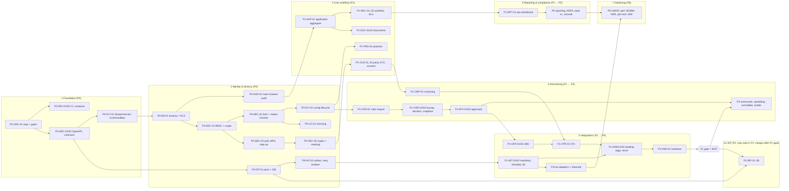

# 06 — Development Plan

| | |
|---|---|
| **Product** | Fundly LOS (working name, D-028) |
| **Version** | 1.0, 8 October 2026 |
| **Baseline** | BRD v0.1 + `01`–`04` + `decision-log.md` (D-001..D-036) |
| **Phase source of truth** | `phase_map.py`. This plan does **not** change any phase it assigns. Items it does not assign are listed in §8.2 with a proposed phase, for PO confirmation. |
| **Companions** | `05-agent-roster.md` (agents, DoD, handoff), `progress-tracker.md` (status) |
| **Audience** | Bank credit committee, bank CTO, PO, build agents |

**Reading convention.** **Fact** = stated in the BRD, TRD, integration register or an approved decision, cited. **Rec** = my recommendation. Requirement IDs are BRD IDs where one exists (TRD convention). Requirements without a BRD ID use LOS IDs. Appendix A maps every BRD ID to its LOS ID. In task tables, `◐→Pn` means the requirement is delivered partially in this task and completed in phase Pn (`phase_map.COMPLETES`), and `†` means the phase is proposed by this plan because `phase_map.py` does not assign one.

**Verification result: PASS.**
- Every one of the 336 inventory items is assigned to exactly one task or to V2:
  - 273 BRD FRs;
  - LOS-FR-274..287 and LOS-FR-301..316;
  - NFR-001..020;
  - LOS-CON-001..013.
- Every assignment matches `phase_map.py` where it has one.
- Details are in §8.

---

## 1. Phase overview and gates

| Phase | Name (phase_map) | Objective | Gate artefact the PO signs |
|---|---|---|---|
| **P0** | Foundation | A secure, tenant-isolated, audited, licensed skeleton that every module builds on | P0 gate pack |
| **P1** | MVP origination | Staff-assisted retail and SME term loans, end to end from capture to booked in the CBA simulator, with production-grade controls (D-036) | P1 gate pack + **MVP acceptance** (§2.4) |
| **P2** | Documents & IDP | Self-hosted IDP service replacing manual verification (D-006) | P2 gate pack |
| **P3** | Decisioning & workflow depth | Scorecards, spreading, committee, parallel workflow, tranches, insider and connected exposure | P3 gate pack |
| **P4** | Live integrations & channels | Finacle and Nigerian providers live and certified; applicant portal, partner API, SSO | P4 gate pack |
| **P5** | Compliance, reporting & data | Nigeria pack v1, NDPA workflows, regulatory and management reporting, licence console | P5 gate pack + pack v1 sign-off |
| **P6** | Hardening & certification | HA/DR, performance, WORM, KMS/HSM, pen test, adapter SDK: v1.0 release | P6 gate pack + v1.0 release approval |

**Gate rules.**
1. **Hard gates.** No task in phase *n+1* is dispatched until the PO signs the phase *n* gate. The single exception is rule 2.
2. **Overlap rule (P2 IDP).**
   - S1 IDP service work (tasks `P2-IDP-*` and `P2-QA-01`) may start during P1, because S1 is a separate deployable (TRD §2.1).
   - It lives on `phase/P2-idp` (05 §4.2) and **cannot merge to `main` until the P1 gate is signed**.
   - LOS-side P2 tasks (`P2-DOC-*`, `P2-FE-01`, `P2-SEC-01`) start only after the P1 gate.
3. **Gate evidence pack** (`docs/gates/<phase>.md`), assembled by the Tech Lead. It contains:
   - CI run for the gate tag;
   - traceability extract for the phase;
   - coverage, conformance and scan reports;
   - ASVS delta;
   - axe report;
   - demo recording or script log;
   - open risks and defects;
   - list of partial requirements and what remains.
4. **Common exit criteria.** These apply to every phase, in addition to the phase-specific criteria:

| # | Criterion | Measure |
|---|---|---|
| C1 | Tasks | 100% of the phase's tasks Done per DoD (05 §5) |
| C2 | Traceability | 100% of requirements first delivered in the phase have ≥ 1 passing tagged test (computed by CI from `->group()`). Partial (◐) requirements: all acceptance criteria for this increment pass. |
| C3 | Coverage | ≥ 90% line coverage on `Domain` + `Shared`; 100% of reason-code paths (TRD §13) |
| C4 | API conformance | Spectral 0 errors; 100% of phase endpoints exercised by feature tests with response validation; oasdiff: no breaking change against the previous gate tag |
| C5 | Architecture | Deptrac, vendor-identifier, policy-middleware, no-float-money and no-DB-in-Domain tests 100% green |
| C6 | Security | 0 open high/critical from Semgrep, composer/npm/pip audit, Trivy; Gitleaks 0; ZAP baseline 0 high; authorisation matrix covers 100% of phase endpoints (authorised / unauthorised / out-of-scope) |
| C7 | Data integrity | RLS cross-tenant suite green with ≥ 2 tenants; `audit:verify` green on the gate dataset; tamper test rejected |
| C8 | Accessibility | axe: 0 serious/critical violations on every screen delivered in the phase |
| C9 | Demo | Phase demo script executed in front of the PO on a clean install of the gate tag |
| C10 | Defects | 0 open Sev-1/Sev-2 defects against phase requirements |

---

## 2. MVP definition (D-036)

**Fact.** D-036 defines the MVP as "staff-assisted retail and SME term-loan origination for one commercial bank, end to end from capture to booked in the CBA simulator, with production-grade controls". Those controls are RBAC + scope, maker-checker, SoD, hash-chained audit, idempotent CBA saga and licence enforcement. **MVP = P0 + P1.**

### 2.1 In the MVP
| Area | In scope | Basis |
|---|---|---|
| Channel | Staff-assisted UI + the same `/api/v1` API | FR-CHN-001 ◐, D-036 |
| Applicants | Individual and limited company, beneficial owners, joint applicants and guarantors | FR-CUS-001 ◐, FR-CUS-006, FR-APP-004 |
| Products | Configurable term-loan products with versioning, fees, checklists, bound workflow, policy and matrix | FR-PRD-001..006, 009 |
| KYC / AML | BVN/NIN and screening via **stub** adapters; CDD gate; consent; alert workspace with four-eyes | FR-CUS-003/005 ◐, FR-CMP-010/011/013 ◐/014/017/021/032 |
| Documents | Upload, AV scan, hashed immutable versions, checklist, waivers, expiry, **manual verification** behind the IDP port | FR-DOC-001 ◐, 002, 004..009 |
| Decisioning | Rules engine, one bureau via stub, affordability, decision snapshot + replay, counter-offer, memo, exceptions | FR-CRD-001..004, 008, 010, 011, 013..015 |
| Collateral | Full except external registry | FR-COL-001..006, 008 |
| Workflow / approvals | Configurable workflow, routing, inbox, SLA; matrix, limits, sequential chains, SoD, delegation, validity | FR-WFL-001, 003..012; FR-APV-001..003 ◐, 005..010, 012 |
| Offer → booking | Templates, key facts, schedule, wet-sign + e-sign stub, CPs, maker-checker release, booking saga against the **CBA simulator**, reconciliation, handover event | FR-OFR-*, FR-CPR-001..005, FR-DSB-001..009, 011, FR-HND-001/003/004 |
| Controls | RBAC + scope, SoD, maker-checker, MFA (TOTP) + step-up, LDAP, field encryption, masking, hash-chained audit, evidence pack, temporal query | FR-SEC-*, FR-AUD-*, FR-CMP-036, LOS-FR-302/305 |
| Licensing | Offline signed licence, enforcement, D-034 fail-safes | LOS-FR-316 |
| Deployment | Single-node profile (UAT/pilot; **does not meet NFR-005/008**, TRD §2.4) | NFR-009 |

### 2.2 Out of the MVP
| Excluded | Lands in | Basis |
|---|---|---|
| Applicant portal, agent PWA, partner API, leads, pre-qualification, bulk upload | P4 | D-009, D-036 |
| Real IDP extraction and statement analysis | P2 | D-036 |
| Committee e-voting, parallel/quorum approval, spreading, scorecards, risk-based pricing | P3 | D-036, D-012 |
| Corporate segment depth; sole-proprietor, partnership and cooperative applicants | P3 | FR-CUS-001 ◐, FR-CRD-012 |
| Connected-group exposure, insider register and routing | P3 | FR-CRD-007, FR-CUS-010, FR-CMP-024 |
| Tranches, revolving activation, third-party payouts, reversal | P3 | FR-DSB-002 ◐/003/012 |
| SSO (SAML/OIDC), SCIM, WebAuthn | P4 | D-036, FR-SEC-012 |
| Live Finacle, NIBSS, NIMC, bureaus, screening, e-signature, mandates, payroll | P4 | `04` register |
| SMS / WhatsApp / push channels | P4 | FR-NTF-001 ◐ |
| Advanced reporting, CRMS, STR extracts, NDPA DSR/retention workflows, adverse action, human review route | P5 | phase_map |
| HA/DR certification, HSM/Vault KMS, WORM certification, pen test, adapter SDK | P6 | phase_map |

**Rec: consequence the credit committee should note.** Bureau, identity and screening are stubs in the MVP. The MVP is therefore a **controlled UAT/demonstration release**, not a release for live credit decisions on real customers. A production pilot with the design partner (D-008) needs, at minimum:
- P4-INT-01 (Finacle);
- P4-INT-03 (BVN/NIN);
- P4-INT-04 (bureaus);
- P4-INT-05 (screening);
- the P5 compliance items in §9.

§9 issue 8 asks the PO to confirm this reading.

### 2.3 MVP demo script (end-to-end journey)
Run on a clean single-node install of tag `v0.1.0`, with the CBA simulator and mock providers. The legal entity is "Demo Bank Plc" under the Nigeria × commercial bank pack v0. Each step lists what the audience must see.

| # | Actor (role) | Action | Must see / verify |
|---|---|---|---|
| 1 | DevOps | Install from the offline bundle; import the signed licence (maker), approve (checker) | Signature verified; licence shown with modules, caps and expiry; both actions in audit with step-up reference |
| 2 | Tenant Admin | Show the effective-access view for the RM; attempt to assign a role pair violating SoD | Assignment blocked with the SoD rule cited; attempt audit-logged |
| 3 | Product Manager (maker) + Head of Credit (checker) | Create "SME Term Loan v1" with fees, checklist, bound workflow, rule set and approval matrix; submit; checker activates | Activation only via change request; maker cannot approve own request; config version recorded |
| 4 | RM (LDAP login + TOTP) | Create application; capture limited company + 2 directors + guarantor; dedupe hit on an existing customer | Human reference `DEMO-2026-000001`; dedupe warning with matched fields; field provenance recorded |
| 5 | RM | Verify director BVN (stub); capture consents (bureau, processing) | KYC check stored with provider, timestamp and match scores; BVN masked by default; unmask requires purpose + step-up and is logged |
| 6 | System | Intake screening: one director returns a PEP hit (fault fixture) | Alert raised; application blocked at KycScreening |
| 7 | RM, then Compliance Officer | RM tries to clear the alert; Compliance clears it with a reason; second officer confirms (four-eyes) | RM refused (FR-CMP-014); disposition, list version and evidence stored |
| 8 | Documentation Officer | Upload CAC documents and statements; EICAR test file uploaded; one item waived | EICAR quarantined and never readable; SHA-256 shown; waiver routed to configured authority; checklist complete |
| 9 | Credit Analyst | Pull bureau (stub) → run decision | Bureau blocked before consent exists (shown first); outcome **refer** with ordered reason codes, risk grade, affordability trace; snapshot ID |
| 10 | Credit Analyst | Override one policy rule with evidence; write credit memo; recommend | Exception recorded; matrix escalates one authority level automatically |
| 11 | Approver L1, then L2 | RM (originator) attempts to approve; L1 approves with conditions; L2 approves with step-up | RM refused (FR-APV-005); each vote shows rationale, reason codes and authority basis (limit / matrix row) |
| 12 | System / Analyst | Replay the decision snapshot | Identical outcome and reason codes under the recorded `EVALUATOR_VERSION` |
| 13 | RM | Generate offer: key facts, total cost of credit, schedule; deliver by email + print; record wet-sign acceptance by all signatories in order | PDF from template version X; executed agreement hash stored; signing order enforced |
| 14 | Legal / Ops | Satisfy CPs; leave one mandatory CP open and attempt release; then satisfy it | Release hard-blocked while the CP is open; pre-disbursement re-screen and name enquiry pass |
| 15 | Disbursement Maker, then Checker | Maker creates the instruction; the L2 approver tries to check; a third user checks with step-up | Approver refused as checker (FR-DSB-009); release accepted |
| 16 | System | Saga runs with fault script `timeout_then_success` on `disburse` | Status `pending_cba` → lookup by reference → posted **once**; schedule variance check passes; application **Booked** |
| 17 | System | `facility.created` webhook and handover package | Signed webhook delivered and logged; CS, collateral and insurance items handed over |
| 18 | Ops | Run daily reconciliation; inject an orphan posting in the simulator; re-run | First run 0 breaks; second run 1 break in the exception queue |
| 19 | Auditor | Open the timeline; as-at query for the moment of L1 approval; export evidence pack; run `audit:verify` | As-at state matches; ZIP manifest hashes verify; chain verifies; export itself audit-logged |
| 20 | DBA (superuser) | `UPDATE audit_events …` as the app role, then as superuser; re-run verify | App role rejected by trigger/grants; superuser change **detected** by verify (D-021) |
| 21 | DevOps | Advance the clock past licence expiry + grace with an application mid-saga | New application and new login blocked; in-flight saga completes; auditor read and evidence export still work (D-034) |
| 22 | Ops | Open the operational dashboard as a branch-scoped manager | Only own-subtree applications appear (FR-RPT-010) |

### 2.4 MVP acceptance criteria
| # | Criterion | Threshold |
|---|---|---|
| MVP-1 | Demo script §2.3 | All 22 steps pass twice consecutively on a clean install. The second run uses fault scripts `timeout`, `duplicate` and `partial(step 3)` on separate applications. No manual DB intervention. |
| MVP-2 | Traceability | 100% of P0 + P1 requirements have ≥ 1 passing tagged test; partials pass their P0/P1 acceptance criteria |
| MVP-3 | Exactly-once | Across ≥ 500 simulated disbursements with randomised fault scripts: 0 duplicate postings; every non-posted instruction is in a definite state; reconciliation explains 100% of postings |
| MVP-4 | Controls (negative tests) | 100% pass. Covers: originator ≠ approver; originator ≠ screening clearer; checker ≠ maker ≠ approver; step-up enforced on each TRD §8.2 action; SoD at assignment and action time |
| MVP-5 | Audit | Every state transition in the demo has an audit event with actor, roles snapshot, correlation ID and before/after; chain verifies; tamper detected |
| MVP-6 | Replay | 100% of frozen snapshots in the replay suite reproduce outcome and reason codes |
| MVP-7 | Tenancy | RLS suite: 0 cross-tenant reads or writes with two seeded tenants, for both the app role and the API |
| MVP-8 | Licence | Expiry, grace, cap and fail-safe behaviours per D-034, each with a passing test |
| MVP-9 | API | 100% of MVP operations in OpenAPI 3.1; Spectral 0 errors; response validation in all feature tests; SPA uses only the generated client (lint rule) |
| MVP-10 | Security | Common criterion C6 + authenticated ZAP 0 high + ASVS L2 checklist (L3 for V2/V3/V6/V8) with evidence + threat model reviewed by the PO |
| MVP-11 | Accessibility | axe 0 serious/critical on all MVP screens; manual screen-reader pass on capture and approval journeys |
| MVP-12 | Performance smoke (**not** certification) | API p95 ≤ 500 ms and decision run internal p95 < 2 s, at 50 concurrent virtual users on the single-node reference VM. The VM spec is recorded in the gate pack. |
| MVP-13 | Installability | A different agent installs the offline bundle on a clean VM using only the published install guide |
| MVP-14 | Documentation | Role guides (RM, Analyst, Approver, Compliance, Disbursement, Admin, Auditor), admin guide, API guide v1, release notes stating every stub |

---

## 3. Phases in detail

Task sizes: **S** ≤ 2 agent-days, **M** 3–5, **L** 6–10. Larger work is split before dispatch.

### 3.0 P0: Foundation
- **Objectives.**
  - Repository, CI and supply-chain gates.
  - The `Shared` kernel with the CommandBus invariant.
  - Tenancy with forced RLS.
  - Hash-chained audit.
  - RBAC with scope, SoD and the maker-checker engine.
  - Local auth + MFA + step-up.
  - Field encryption and masking.
  - Integration Runtime core (outbox, idempotency, retry, breaker, taxonomy).
  - Offline licensing.
  - The OpenAPI contract pipeline.
  - SPA shell.
- **Modules (TRD §4).** M01, M02, M17 (runtime core), M19 (trail), M21, plus `Shared`.
- **Agents.** Tech Lead, Architect, BE Platform & Access, BE Disbursement & Integration Runtime, Integration, Database, Security & Compliance, UI/UX, Frontend, QA, DevOps, Req Analyst, Documentation.

| Module | Requirements first delivered | of which partial | Partials completed here |
|---|---|---|---|
| Cross-cutting NFR | 3 | — | — |
| Cross-cutting principle | 12 | — | — |
| M01 Platform | 4 | — | — |
| M02 Identity & Access | 17 | 1 | — |
| M17 Integration Runtime | 8 | — | — |
| M18 Compliance | 1 | — | — |
| M19 Audit & Evidence | 7 | — | — |
| M21 Licensing & Operator | 1 | — | — |
| **Total** | **53** | **1** | **0** |

| Task | Scope | Delivers (requirement IDs) | Completes | Depends on | Owner | Size |
|---|---|---|---|---|---|---|
| **P0-ORC-01** | Monorepo scaffold (TRD §2.2), Pint, Larastan L8, Deptrac module rules, ESLint/tsc strict, Ruff/mypy, PR template, CODEOWNERS, traceability CI job (Pest groups → 08 matrix) | `LOS-CON-013` † | — | — | Tech Lead | M |
| **P0-DEV-01** | CI pipeline stages (TRD §13): lint, static, test, contract, Semgrep, composer/npm audit, Trivy, Gitleaks, ZAP baseline; cosign-signed OCI images; CycloneDX SBOM | `NFR-009`, `LOS-CON-010` †, `LOS-CON-011` † | — | P0-ORC-01 | DevOps | M |
| **P0-DEV-02** | Single-node compose profile (api, worker, scheduler, nginx, PG16, Redis, MinIO+Object Lock, ClamAV, Gotenberg, OTel collector); egress allow-list test proving no external SaaS on core paths | `LOS-CON-012` † | — | P0-ORC-01 | DevOps | M |
| **P0-OBS-01** | Correlation-ID middleware, OTel PHP SDK, Monolog JSON, RED metrics, health/readiness endpoints | `NFR-011` | — | P0-DEV-02 | DevOps | M |
| **P0-ARC-01** | OpenAPI 3.1 source tree, Spectral ruleset (RFC 9457 problems, Idempotency-Key, security scheme per operation), response validator in Pest, oasdiff gate, SPA client generation | `NFR-019`, `LOS-CON-001` † | — | P0-ORC-01 | Architect | M |
| **P0-ARC-02** | ADRs + module Contracts namespaces M01–M21, domain-event catalogue, problem-type catalogue, permission catalogue v0 | — (enabling) | — | P0-ORC-01 | Architect | S |
| **P0-PLT-01** | Shared kernel: UUIDv7, Money (numeric(20,4), float ban rule), Clock, CommandBus enforcing policy→validate→mutate→audit→outbox in one transaction, event-store primitive | `LOS-CON-004` † | — | P0-ARC-02 | BE Platform & Access | L |
| **P0-DB-01** | Tenancy: tenants, legal_entities, org_units + closure table; TenantScope; FORCE RLS on every tenant table; non-owner app role; SET LOCAL app.tenant_id per transaction; cross-tenant test kit | `FR-TEN-001`, `FR-TEN-003` | — | P0-PLT-01 | Database | L |
| **P0-AUD-01** | Hash-chained audit_events (partitioned, per-tenant seq, advisory lock), UPDATE/DELETE/TRUNCATE trigger, INSERT/SELECT-only grants, checkpoints, audit:verify, named system identities, retention independent of operational purge | `FR-AUD-001`, `FR-AUD-002`, `FR-AUD-003`, `FR-AUD-004`, `FR-AUD-005`, `FR-AUD-012` | — | P0-DB-01, P0-PLT-01 | Database | L |
| **P0-PLT-02** | Configuration artefact lifecycle (draft→review→approved→active), versioning, config layer model (§17 layers 1–6) | `FR-TEN-009`, `LOS-FR-284`, `LOS-CON-003` † | — | P0-SEC-02 | BE Platform & Access | M |
| **P0-SEC-01** | Permission catalogue, roles, assignments with all scope dimensions, deny-by-default, union of assignments, field-level control, ScopeFilter for lists, policy-middleware arch test | `FR-SEC-001`, `FR-SEC-002`, `FR-SEC-003`, `FR-SEC-004`, `FR-SEC-005`, `LOS-CON-007` † | — | P0-DB-01 | BE Platform & Access | L |
| **P0-SEC-02** | SoD matrix (assignment-time + action-time), generic maker-checker engine (change_requests, fail-stale), time-bound assignments and elevation | `FR-SEC-006`, `FR-SEC-007`, `FR-SEC-008` | — | P0-SEC-01, P0-AUD-01 | BE Platform & Access | L |
| **P0-SEC-03** | Local identity store (Argon2id, offline breached-password list, lockout), TOTP MFA, step-up, Sanctum SPA session (__Host- cookie, CSRF), idle/absolute timeouts, concurrent-session cap, revoke on role change | `LOS-FR-302`, `FR-SEC-013`, `FR-SEC-015` | — | P0-SEC-01 | BE Platform & Access | L |
| **P0-SEC-04** | Standard role library (19 templates), effective-access view, service-account principals under the same policy layer | `LOS-FR-278`, `FR-SEC-011`, `FR-SEC-014` | — | P0-SEC-02 | BE Platform & Access | M |
| **P0-SEC-05** | KeyManagementPort (local keyfile), per-tenant DEK envelope encryption, field-level encryption + blind indexes, TLS 1.3 config, masked-by-default serialisation, /pii/unmask with purpose + step-up + pii_access_log | `FR-SEC-016` ◐→P6, `FR-SEC-017`, `FR-CMP-036`, `LOS-CON-009` † | — | P0-SEC-03, P0-AUD-01 | Security & Compliance | L |
| **P0-SEC-06** | AppSec baseline: rate limits, FormRequest/JSON Schema validation, CSP, upload hardening policy, auth-event logging; threat model v1; ASVS 4.0.3 checklist v0 | `FR-SEC-019`, `FR-AUD-007` | — | P0-SEC-03 | Security & Compliance | M |
| **P0-INT-01** | Integration/Ports namespace, canonical CBI v1.0 contract (OpenAPI/JSON Schema), adapter registry and binding model, vendor-identifier arch test, same pattern for every port | `FR-CBA-001`, `FR-CBA-002`, `FR-CBA-020`, `LOS-CON-002` † | — | P0-ARC-02 | Integration | M |
| **P0-INT-02** | Integration Runtime: transactional outbox + dispatcher, idempotency-key store, retry/backoff/jitter, Redis circuit breaker + alert, error taxonomy, integration_calls log (PII-masked), exception queue | `FR-CBA-007`, `FR-CBA-008`, `FR-CBA-010`, `FR-CBA-011`, `FR-CBA-016`, `LOS-CON-005` †, `LOS-CON-008` † | — | P0-INT-01, P0-PLT-01 | BE Disbursement & Integration Runtime | L |
| **P0-LIC-01** | LicensingPort + OfflineSignedFileLicensing (Ed25519, installation fingerprint), enforcement points, D-034 fail-safe exemptions, T-60/30/7 warnings, licence import via maker-checker | `LOS-FR-316` | — | P0-SEC-02 | BE Platform & Access | M |
| **P0-UX-01** | Design-system port: AuditPro components → TS, Fundly v3 tokens contrast-corrected (D-027, G-46), WCAG 2.2 AA token audit, auth screen designs | — (enabling) | — | P0-ORC-01 | UI/UX | M |
| **P0-FE-01** | SPA shell: React 19/Vite/TS strict, generated client only, routing, TanStack Query, auth/MFA/step-up/session-expiry flows, effective-access screen, Playwright+axe scaffold | — (enabling) | — | P0-ARC-01, P0-UX-01, P0-SEC-03 | Frontend | L |
| **P0-QA-01** | Test harness: Pest + PG service container, factories, role×endpoint authorisation-matrix generator, RLS cross-tenant suite, audit-chain tamper tests, coverage gates | — (enabling) | — | P0-ORC-01, P0-DB-01 | QA/Test | M |
| **P0-REQ-01** | Acceptance criteria for all P0/P1 requirements; 08-traceability-matrix generator wired to phase_map.py and Pest groups | — (enabling) | — | P0-ORC-01 | Req Analyst | M |
| **P0-DOC-01** | Developer guide, ADR index, API style guide, contribution rules (D-035), runbook skeleton | — (enabling) | — | P0-ARC-01 | Documentation | S |

- **Deliverables.** Tag `v0.0.x` (foundation); CI pipeline; single-node compose; OpenAPI skeleton covering auth, access, licensing and platform endpoints; threat model v1; ASVS checklist v0; acceptance criteria for P0 + P1; traceability generator.
- **Exit criteria (in addition to C1–C10).**
  - P0-X1: CommandBus arch test proves no handler can commit without an audit event.
  - P0-X2: audit insert p95 ≤ 20 ms at 50 writes/s sustained on the dev reference VM. This is an early warning for R-09, not certification.
  - P0-X3: RLS bypass attempts fail as the app role, including `SET ROLE` and a missing `app.tenant_id`.
  - P0-X4: a licence with a bad signature is refused; an expired licence leaves in-flight saga stubs and auditor read untouched.
  - P0-X5: the vendor-identifier arch test fails on a seeded violation (the test proves itself).
  - P0-X6: all Laravel 13 packages in the composer lock are compatible, and the R-08 spike is closed.
  - **Traceability: 53/53 P0 requirements (100%).**

### 3.1 P1: MVP origination
- **Objectives.** Deliver the D-036 MVP (§2): the full staff-assisted journey to Booked in the simulator, with all controls.
- **Modules.** M01, M02 (LDAP, auditor), M03–M17 (MVP scope per TRD §4 MVP column), M18 (pack framework, screening, CDD, consent, single-obligor), M19, M20 (operational dashboard).
- **Agents.** All except IDP. IDP may start S1 work under the overlap rule.

| Module | Requirements first delivered | of which partial | Partials completed here |
|---|---|---|---|
| Cross-cutting NFR | 7 | — | — |
| Cross-cutting principle | 1 | — | — |
| M01 Platform | 5 | 1 | — |
| M02 Identity & Access | 2 | — | — |
| M03 Product Factory | 7 | — | — |
| M04 Origination | 4 | 1 | — |
| M05 Party & KYC | 9 | 4 | — |
| M06 Application | 10 | — | — |
| M07 Documents & IDP | 8 | 1 | — |
| M08 Decisioning | 10 | 2 | — |
| M09 Collateral | 7 | — | — |
| M10 Workflow | 11 | 1 | — |
| M11 Approvals | 10 | 1 | — |
| M12 Offer & Execution | 11 | 2 | — |
| M13 Conditions | 5 | 2 | — |
| M14 Disbursement | 10 | 1 | — |
| M15 Handover | 3 | — | — |
| M16 Notifications | 3 | 1 | — |
| M17 Integration Runtime | 9 | 1 | — |
| M18 Compliance | 15 | 3 | — |
| M19 Audit & Evidence | 6 | 1 | — |
| M20 Reporting | 2 | 1 | — |
| **Total** | **155** | **23** | **0** |

| Task | Scope | Delivers (requirement IDs) | Completes | Depends on | Owner | Size |
|---|---|---|---|---|---|---|
| **P1-PLT-01** | Reference data, calendars, FX rates, multi-currency, effective-dated prudential parameters (maker-checker), jurisdiction-pack resolution by legal entity, en-NG formatting | `FR-TEN-006`, `FR-TEN-007`, `LOS-FR-307`, `LOS-FR-310`, `NFR-017` | — | P0-PLT-02 | BE Platform & Access | M |
| **P1-PLT-02** | Admin console API for layers 1–4 (products, rules, matrices, users, workflow JSON), configuration validator, live config without restart | `FR-CFG-001` ◐→P5, `FR-CFG-002`, `NFR-012` | — | P0-PLT-02 | BE Platform & Access | M |
| **P1-SEC-01** | LDAP/AD bind + group mapping (DirectoryPort), Auditor role (read-only, unrestricted scope) | `LOS-FR-305`, `LOS-FR-279` | — | P0-SEC-03, P0-SEC-04 | BE Platform & Access | M |
| **P1-PRD-01** | Product factory: products/versions, categories, terms/fees/interest basis, conditional checklists, bound workflow/policy/matrix, effective-dated versioning with in-flight pinning | `FR-PRD-001`, `FR-PRD-002`, `FR-PRD-003`, `FR-PRD-004`, `FR-PRD-005`, `FR-PRD-006` | — | P1-PLT-02 | BE Origination & Application | L |
| **P1-PRD-02** | CBA product/GL/branch/currency/customer-type mapping per binding (maker-checker) | `FR-PRD-009`, `FR-CBA-012` | — | P1-PRD-01, P0-INT-01 | Integration | M |
| **P1-CHN-01** | Staff-assisted channel + API capture, channel attribution, save-and-resume with expiry, intake dedupe (blind index + trigram) | `FR-CHN-001` ◐→P4, `FR-CHN-002`, `FR-CHN-003`, `FR-CHN-007` | — | P1-APP-01 | BE Origination & Application | M |
| **P1-CUS-01** | Party model: individual + limited company, beneficial ownership to threshold | `FR-CUS-001` ◐→P3, `FR-CUS-006` | — | P0-SEC-05 | BE Origination & Application | M |
| **P1-CUS-02** | CBA pre-population, BVN/NIN via IdentityVerificationPort (stub), customer 360 via simulator, new-to-bank creation step | `FR-CUS-002`, `FR-CUS-003` ◐→P4, `FR-CUS-009` ◐→P4, `FR-CUS-011` | — | P1-CUS-01, P1-INT-02 | BE Origination & Application | M |
| **P1-CUS-03** | Risk-based CDD rule table + progression gate, granular consent with withdrawal and history, bureau-consent precondition | `FR-CUS-007`, `FR-CUS-008`, `FR-CMP-010`, `FR-CMP-021`, `FR-CMP-032` | — | P1-CUS-01, P1-CRD-01 | BE Origination & Application | M |
| **P1-CMP-01** | ScreeningPort (stub): intake/approval/pre-disbursement screening of all parties, evidence retention, alert workspace with four-eyes, originator-cannot-clear | `FR-CUS-005` ◐→P4, `FR-CMP-011`, `FR-CMP-013` ◐→P4, `FR-CMP-014`, `FR-CMP-017` | — | P1-CUS-01, P0-SEC-02 | BE Decisioning & Approvals | L |
| **P1-APP-01** | Event-sourced application aggregate, human reference, canonical state machine + cross-cutting states, terminal states with mandatory reasons, ETag/If-Match | `FR-APP-001`, `FR-APP-006`, `LOS-FR-282`, `LOS-FR-283` | — | P0-PLT-01, P0-AUD-01 | BE Origination & Application | L |
| **P1-APP-02** | Schema-driven dynamic forms, multiple applicants/guarantors, pre-approval amendment with field history, completeness indicator, field provenance | `FR-APP-002`, `FR-APP-004`, `FR-APP-005`, `FR-APP-008`, `LOS-FR-301`, `NFR-013` | — | P1-APP-01, P1-PRD-01 | BE Origination & Application | L |
| **P1-APP-03** | Application- and stage-level SLA clocks over the tenant calendar with pause/resume | `FR-APP-009` | — | P1-APP-01, P1-PLT-01 | BE Origination & Application | M |
| **P1-DOC-01** | Upload API (web + API, tus resumable), format/size policy, ClamAV gate, SHA-256 before store, Object-Lock immutable versions, hash/similarity duplicate detection | `FR-DOC-001` ◐→P4, `FR-DOC-002`, `FR-DOC-004`, `FR-DOC-005`, `FR-DOC-006` | — | P1-APP-01, P0-SEC-05 | BE Origination & Application | L |
| **P1-DOC-02** | Per-application checklist with statuses, waivers via authority, expiry tracking, manual-verification IDP adapter | `FR-DOC-007`, `FR-DOC-008`, `FR-DOC-009` | — | P1-DOC-01, P1-PRD-01 | BE Origination & Application | M |
| **P1-CRD-01** | Rules engine: sandboxed evaluator (decimal), fact schema, decision tables/trees/expressions, versioned rule sets, EVALUATOR_VERSION | `FR-CRD-001`, `FR-CRD-002` ◐→P3 | — | P0-PLT-02 | BE Decisioning & Approvals | L |
| **P1-CRD-02** | CreditBureauPort (one bureau stub), canonical credit profile parser, bureau-before-approval gate with pack validity window | `FR-CRD-003` ◐→P4, `FR-CRD-004`, `FR-CMP-020` | — | P1-CRD-01, P1-CUS-03 | BE Decisioning & Approvals | M |
| **P1-CRD-03** | Decision flow: affordability formulas, structured outcome, counter-offer, immutable snapshot + replay, reason codes, exceptions/overrides escalating authority | `FR-CRD-008`, `FR-CRD-010`, `FR-CRD-011`, `FR-CRD-014`, `FR-CRD-015`, `FR-CMP-027`, `FR-CMP-043`, `LOS-CON-006` † | — | P1-CRD-01, P1-CRD-02 | BE Decisioning & Approvals | L |
| **P1-CRD-04** | Credit memo: templated sections auto-populated + analyst narrative, versioned | `FR-CRD-013` | — | P1-CRD-03 | BE Decisioning & Approvals | M |
| **P1-CMP-02** | Single-obligor limit check against prudential parameters and CBA exposure | `FR-CMP-023` ◐→P3 | — | P1-PLT-01, P1-CRD-03 | BE Decisioning & Approvals | M |
| **P1-CMP-03** | Jurisdiction-pack framework: signed versioned bundle, effective-dated rule register with citations, verification_status activation gate; Nigeria × commercial bank v0 | `FR-CMP-001` ◐→P5, `FR-CMP-003` | — | P1-PLT-01 | BE Decisioning & Approvals | L |
| **P1-CMP-04** | Verify every Nigeria pack v0 rule against primary source (TRD §9.4); record citation, URL, retrieval and effective date; PO sign-off | — (enabling) | — | P1-CMP-03 | Security & Compliance | M |
| **P1-COL-01** | Collateral: configurable types, haircuts/FSV/LTV/cover, valuations, perfection lifecycle, multi-facility allocation, insurance, disbursement block | `FR-COL-001`, `FR-COL-002`, `FR-COL-003`, `FR-COL-004`, `FR-COL-005`, `FR-COL-006`, `FR-COL-008` | — | P1-APP-01, P1-CRD-01 | BE Decisioning & Approvals | L |
| **P1-WFL-01** | Workflow engine: definitions/versions, stage→canonical mapping, guards, validator, in-flight version pinning | `FR-WFL-001`, `FR-WFL-012` | — | P1-APP-01, P1-CRD-01 | BE Origination & Application | L |
| **P1-WFL-02** | Routing (role/skill/branch/product/band/load), pull + push queues, reassignment and delegation with attribution, task inbox with bulk actions, case notes | `FR-WFL-003`, `FR-WFL-004`, `FR-WFL-005` ◐→P3, `FR-WFL-009`, `FR-WFL-010` | — | P1-WFL-01 | BE Origination & Application | L |
| **P1-WFL-03** | Stage SLA enforcement + escalation, send-back with targeted rework, hold with SLA pause and auto-expiry, configured auto-decisions | `FR-WFL-006`, `FR-WFL-007`, `FR-WFL-008`, `FR-WFL-011` | — | P1-WFL-02, P1-APP-03 | BE Origination & Application | M |
| **P1-APV-01** | Approval matrix as decision table, effective limits (min user/role/org), sequential chains, approver SoD, delegation of authority, auto-escalation | `FR-APV-001`, `FR-APV-002`, `FR-APV-003` ◐→P3, `FR-APV-005`, `FR-APV-006`, `FR-APV-007` | — | P1-CRD-03, P0-SEC-02 | BE Decisioning & Approvals | L |
| **P1-APV-02** | Votes with rationale/reason codes/authority basis/step-up ref, conditional approval → CPs, decision packet, approval validity expiry | `FR-APV-008`, `FR-APV-009`, `FR-APV-010`, `FR-APV-012` | — | P1-APV-01 | BE Decisioning & Approvals | M |
| **P1-OFR-01** | Offer templates (versioned), key-facts/cost-of-credit per pack method, schedule from CBA/LOS, Gotenberg PDF | `FR-OFR-001`, `FR-OFR-002`, `FR-OFR-003`, `FR-CMP-025` | — | P1-APV-02, P1-CMP-03 | BE Disbursement & Integration Runtime | L |
| **P1-OFR-02** | Offer delivery (email + printable), acceptance (wet-sign + e-sign stub), validity/reminders/re-issue, reject/negotiate loop, ordered multi-party signing, immutable executed agreement, execution method per template | `FR-OFR-004` ◐→P4, `FR-OFR-005`, `FR-OFR-006` ◐→P4, `FR-OFR-007`, `FR-OFR-008`, `FR-OFR-009`, `FR-OFR-010`, `LOS-FR-314` | — | P1-OFR-01, P1-NTF-01 | BE Disbursement & Integration Runtime | L |
| **P1-CPR-01** | CP/CS items, mandatory-CP hard block, pre-disbursement checklist, pre-disbursement re-screen (stub), destination name enquiry (simulator) | `FR-CPR-001`, `FR-CPR-002`, `FR-CPR-003`, `FR-CPR-004` ◐→P4, `FR-CPR-005` ◐→P4 | — | P1-OFR-02, P1-CMP-01 | BE Disbursement & Integration Runtime | M |
| **P1-DSB-01** | Booking saga: ensure customer → create loan account → single disbursement → fees → schedule variance check; exactly-once keys, pending/failed sub-states, lookup-before-retry, compensation | `FR-DSB-001`, `FR-DSB-002` ◐→P3, `FR-DSB-004`, `FR-DSB-005`, `FR-DSB-006`, `FR-DSB-007`, `FR-CBA-009`, `LOS-FR-313` | — | P1-CPR-01, P0-INT-02, P1-INT-02 | BE Disbursement & Integration Runtime | L |
| **P1-DSB-02** | Disbursement maker-checker (checker ≠ maker ≠ approver, step-up), advice + final schedule, daily reconciliation runs and break queue | `FR-DSB-008`, `FR-DSB-009`, `FR-DSB-011`, `FR-CBA-017` | — | P1-DSB-01 | BE Disbursement & Integration Runtime | M |
| **P1-HND-01** | Booked transition, facility.created event + signed webhook, CS/collateral/insurance handover package, origination-record retention | `FR-HND-001`, `FR-HND-003`, `FR-HND-004` | — | P1-DSB-01 | BE Disbursement & Integration Runtime | M |
| **P1-NTF-01** | Notification module: email (SMTP) + in-app + webhook, templates per event/channel with maker-checker, communication log | `FR-NTF-001` ◐→P4, `FR-NTF-002`, `FR-NTF-005` | — | P0-SEC-02, P0-INT-02 | BE Disbursement & Integration Runtime | M |
| **P1-INT-01** | Capability manifests, unsupported-operation substitution (manual task / batch / LOS compute), sync/async/batch/MQ styles, reference-data cache (no balance caching) | `FR-CBA-003`, `FR-CBA-004`, `FR-CBA-005`, `FR-CBA-019` | — | P0-INT-02 | Integration | L |
| **P1-INT-02** | CBA simulator + mock providers for every MVP port with fault scripts; production-bind refusal; certification kit v1 run against simulator | `FR-CBA-015`, `FR-CBA-013` ◐→P6, `NFR-006`, `NFR-018` | — | P0-INT-02 | Integration | L |
| **P1-AUD-01** | PII/application read-access log, integration-call audit, audit explorer API, as-at temporal query, evidence pack v1, overrides/waivers report | `FR-AUD-006`, `FR-AUD-008`, `FR-AUD-009`, `FR-AUD-010` ◐→P5, `FR-AUD-011`, `FR-AUD-016` | — | P1-APP-01, P0-INT-02 | BE Platform & Access | L |
| **P1-RPT-01** | Operational dashboard (pipeline, TAT, SLA breaches, queues) with ScopeFilter enforcement on every report | `FR-RPT-001` ◐→P5, `FR-RPT-010` | — | P1-WFL-03 | BE Platform & Access | M |
| **P1-UX-01** | MVP screen designs per role journey (capture → booked, auditor), states, empty/error states, responsive 768 px | — (enabling) | — | P0-UX-01 | UI/UX | L |
| **P1-FE-01** | Admin console UI: products, rule tables, matrices, users/roles/SoD, workflow, change-request inbox | — (enabling) | — | P1-UX-01, P1-PLT-02 | Frontend | L |
| **P1-FE-02** | Origination UI: application capture, parties, consents, KYC/screening, documents and checklist | — (enabling) | — | P1-UX-01, P1-APP-02, P1-DOC-02 | Frontend | L |
| **P1-FE-03** | Assessment UI: bureau, decision result + reason codes, memo, collateral, approval packet and voting with step-up | — (enabling) | — | P1-UX-01, P1-APV-02 | Frontend | L |
| **P1-FE-04** | Execution UI: offer, CPs, disbursement maker/checker, exception and recon queues, audit explorer, evidence pack, dashboard | — (enabling) | — | P1-UX-01, P1-DSB-02, P1-AUD-01 | Frontend | L |
| **P1-FE-05** | Accessibility and browser matrix certification of MVP screens (axe on every screen, manual SR audit, Chrome/Edge/Safari/Firefox current+previous) | `NFR-014`, `NFR-015` † | — | P1-FE-04 | Frontend | M |
| **P1-QA-01** | MVP E2E suite (demo script §2.3) in Playwright, resilience tests with fault injection, replay test against frozen snapshots | — (enabling) | — | P1-FE-04 | QA/Test | L |
| **P1-QA-02** | Authorisation-matrix, out-of-scope and RLS tests for every P1 endpoint; OpenAPI conformance report | — (enabling) | — | P1-DSB-02 | QA/Test | M |
| **P1-SEC-02** | MVP security assurance: threat-model update, ASVS L2 (L3 for V2/V3/V6/V8) checklist evidence, authenticated ZAP, SoD conflict report review | — (enabling) | — | P1-DSB-02 | Security & Compliance | M |
| **P1-DEV-01** | MVP install bundle (single-node), installation-qualification checklist, nightly restore test, demo/UAT environment with simulators and synthetic data | — (enabling) | — | P0-DEV-02 | DevOps | M |
| **P1-REQ-01** | UAT scripts per requirement from the matrix; P1 traceability report | — (enabling) | — | P0-REQ-01 | Req Analyst | M |
| **P1-DOC-03** | MVP user guides per role, admin guide, API guide v1, release notes v0.1 | — (enabling) | — | P1-FE-04 | Documentation | M |

- **Deliverables.** Tag `v0.1.0` (MVP); install bundle; Nigeria pack v0 with every activated rule verified; MVP documentation set; MVP gate pack.
- **Exit criteria.** C1–C10, plus MVP-1..MVP-14 (§2.4). **Traceability: 100% of P1 requirements, 155/155.**

### 3.2 P2: Documents & IDP
- **Objectives.**
  - The self-hosted IDP service (D-006) behind `DocumentIntelligencePort`.
  - Human-in-the-loop with confidence thresholds.
  - Statement analytics.
  - Tamper and forgery signals.
  - Document lineage.
- **Modules.** S1 IDP service; M07 Documents & IDP.
- **Agents.** IDP Service, BE Origination & Application, Frontend, UI/UX (C), QA, Security & Compliance, Integration (C), DevOps (C).

| Module | Requirements first delivered | of which partial | Partials completed here |
|---|---|---|---|
| Cross-cutting NFR | 1 | — | — |
| M07 Documents & IDP | 23 | — | — |
| **Total** | **24** | **0** | **0** |

| Task | Scope | Delivers (requirement IDs) | Completes | Depends on | Owner | Size |
|---|---|---|---|---|---|---|
| **P2-IDP-01** | IDP service scaffold (Python 3.12/FastAPI, own `idp` schema, OTel, signed image) + DocumentIntelligencePort live adapter; engine replaceable per tenant | `FR-DOC-054` | — | P0-INT-01 | IDP Service | M |
| **P2-IDP-02** | Image pre-processing: de-skew, de-noise, crop, rotation, contrast, multi-page handling | `FR-DOC-003` | — | P2-IDP-01 | IDP Service | M |
| **P2-IDP-03** | Classification and bundled-PDF page splitting with routing to checklist | `FR-DOC-020`, `FR-DOC-021` | — | P2-IDP-02 | IDP Service | L |
| **P2-IDP-04** | Field and table extraction for the BRD document set, handwriting (mandatory review), tenant templates, canonical schemas | `FR-DOC-022`, `FR-DOC-023`, `FR-DOC-027`, `FR-DOC-028`, `FR-DOC-029` | — | P2-IDP-03 | IDP Service | L |
| **P2-IDP-05** | Per-field confidence with per-field/doc-type/tenant thresholds | `FR-DOC-024` | — | P2-IDP-04 | IDP Service | M |
| **P2-IDP-06** | Statement parsing (PDF/CSV/scanned/API) and transaction categorisation | `FR-DOC-040`, `FR-DOC-041` | — | P2-IDP-04 | IDP Service | L |
| **P2-IDP-07** | Income regularity, debt-service detection, affordability metrics from statements | `FR-DOC-042`, `FR-DOC-043`, `FR-DOC-044` | — | P2-IDP-06 | IDP Service | L |
| **P2-IDP-08** | Statement tampering, forgery indicators, cross-validation against application and other documents | `FR-DOC-045`, `FR-DOC-050`, `FR-DOC-052` | — | P2-IDP-06 | IDP Service | L |
| **P2-DOC-01** | HITL verification queue in LOS, correction capture as training feedback, document lineage | `FR-DOC-025`, `FR-DOC-026`, `FR-DOC-053` | — | P2-IDP-05 | BE Origination & Application | L |
| **P2-DOC-02** | Statement-analysis drill-through API (metric → transactions) | `FR-DOC-046` | — | P2-IDP-07 | BE Origination & Application | M |
| **P2-FE-01** | Document viewer (annotation, redaction, side-by-side, page accept/reject), HITL screen, statement analytics drill-through | `FR-DOC-010` | — | P2-DOC-01, P2-DOC-02 | Frontend | L |
| **P2-QA-01** | Nigerian document benchmark corpus (anonymised), accuracy and p95 latency harness on certified IDP node spec | `NFR-003` † | — | P2-IDP-04 | QA/Test | M |
| **P2-SEC-01** | IDP service security review: pip audit, container scan, no-egress verification, PII handling in `idp` schema | — (enabling) | — | P2-IDP-01 | Security & Compliance | S |

- **Deliverables.** Signed IDP image; benchmark corpus and report; HITL queue; document viewer; model entries ready for the P3 model inventory.
- **Exit criteria.** C1–C10, plus:
  - P2-X1: NFR-003, 20-page extraction p95 ≤ 60 s on the certified IDP node spec.
  - P2-X2: per-field accuracy on the Nigerian corpus is reported per document type. Fields below the PO-approved threshold route 100% to HITL. **Rec:** the thresholds are set by the PO from the benchmark; they are not pre-promised.
  - P2-X3: statement-analysis arithmetic reconciles to the source for 100% of corpus statements, with drill-through.
  - P2-X4: zero outbound network calls from S1 (egress test).
  - P2-X5: the IDP adapter can be replaced by the manual adapter per tenant without a code change (FR-DOC-054).
  - **Traceability: 24/24.**

### 3.3 P3: Decisioning & workflow depth
- **Objectives.**
  - Scorecards and scoring interface.
  - Risk-based pricing and spreading.
  - Fraud checks.
  - Historical simulation.
  - Committee, quorum and mobile approval.
  - Parallel workflow.
  - Connected exposure, insider register and sector limits.
  - Model governance.
  - Tranches and reversal.
  - Conditions subsequent.
  - Post-booking amendment.
  - Remaining applicant types.
- **Modules.** M03, M05, M06, M08, M10, M11, M13, M14, M15, M18, M01 (terminology).
- **Agents.** BE Decisioning & Approvals, BE Origination & Application, BE Disbursement & Integration Runtime, BE Platform & Access, UI/UX, Frontend, QA, Security & Compliance.

| Module | Requirements first delivered | of which partial | Partials completed here |
|---|---|---|---|
| M01 Platform | 1 | — | — |
| M03 Product Factory | 2 | — | — |
| M05 Party & KYC | 1 | — | 1 |
| M06 Application | 2 | — | — |
| M08 Decisioning | 7 | — | 1 |
| M10 Workflow | 1 | — | 1 |
| M11 Approvals | 2 | — | 1 |
| M13 Conditions | 1 | — | — |
| M14 Disbursement | 2 | — | 1 |
| M15 Handover | 1 | — | — |
| M18 Compliance | 5 | — | 1 |
| **Total** | **25** | **0** | **6** |

| Task | Scope | Delivers (requirement IDs) | Completes | Depends on | Owner | Size |
|---|---|---|---|---|---|---|
| **P3-PRD-01** | Product availability rules (channel/branch/segment/date) and product simulation sandbox | `FR-PRD-007`, `FR-PRD-008` | — | P1-PRD-01 | BE Origination & Application | M |
| **P3-TEN-01** | Tenant terminology overrides across UI, documents and notifications | `FR-TEN-005` | — | P1-PLT-02 | BE Platform & Access | S |
| **P3-APP-01** | Extension attributes (JSON Schema, GIN) usable in rules/templates/reports; application cloning | `FR-APP-003`, `FR-APP-007` | — | P1-APP-02 | BE Origination & Application | M |
| **P3-CUS-01** | Remaining applicant types (sole proprietor, partnership, group/cooperative) | — (enabling) | `FR-CUS-001` | P1-CUS-01 | BE Origination & Application | M |
| **P3-CUS-02** | Related-party/connected-exposure linkage and aggregated exposure (CBA + in-flight) | `FR-CUS-010`, `FR-CRD-007` | — | P1-CUS-02 | BE Decisioning & Approvals | L |
| **P3-CRD-01** | Application and behavioural scorecards (versioned) + common scoring interface for external/local models | `FR-CRD-005`, `FR-CRD-006` | — | P1-CRD-03 | BE Decisioning & Approvals | L |
| **P3-CRD-02** | Risk-based pricing matrices | `FR-CRD-009` | — | P3-CRD-01 | BE Decisioning & Approvals | M |
| **P3-CRD-03** | Financial spreading for SME/corporate (manual + extracted), ratios, projections | `FR-CRD-012` | — | P1-CRD-03 | BE Decisioning & Approvals | L |
| **P3-CRD-04** | Decision-time fraud checks: velocity, device/IP, internal blacklist | `FR-CRD-017` | — | P1-CRD-03 | BE Decisioning & Approvals | M |
| **P3-CRD-05** | Historical application import and simulation against stored snapshots with outcome diff | `LOS-FR-308` | `FR-CRD-002` | P1-CRD-03 | BE Decisioning & Approvals | M |
| **P3-WFL-01** | Parallel branches with join conditions; out-of-office cover | `FR-WFL-002` | `FR-WFL-005` | P1-WFL-03 | BE Origination & Application | L |
| **P3-APV-01** | Parallel and quorum approval; committee workflow (agenda, packet, e-voting, minutes); mobile approval with step-up | `FR-APV-004`, `FR-APV-011` | `FR-APV-003` | P1-APV-02 | BE Decisioning & Approvals | L |
| **P3-CMP-01** | Insider/related-party register, automatic insider flag + elevated path, sector/insider limits | `LOS-FR-306`, `FR-CMP-024` | `FR-CMP-023` | P3-CUS-02 | BE Decisioning & Approvals | M |
| **P3-CMP-02** | Model inventory, validation record + maker-checker before activation, drift monitoring | `FR-CMP-040`, `FR-CMP-041`, `FR-CMP-042` | — | P3-CRD-01 | BE Decisioning & Approvals | M |
| **P3-CPR-01** | Post-disbursement conditions subsequent tracking, servicing handover, breach escalation | `FR-CPR-006` | — | P1-HND-01 | BE Disbursement & Integration Runtime | M |
| **P3-DSB-01** | Tranched/milestone, revolving activation, third-party payout modes; tranche conditions/approval/release | `FR-DSB-003` | `FR-DSB-002` | P1-DSB-02 | BE Disbursement & Integration Runtime | L |
| **P3-DSB-02** | Disbursement cancellation/reversal within window with compensating CBA instructions | `FR-DSB-012` | — | P1-DSB-02 | BE Disbursement & Integration Runtime | M |
| **P3-HND-01** | Post-booking audited amendment process | `FR-HND-005` | — | P1-HND-01 | BE Disbursement & Integration Runtime | M |
| **P3-UX-01** | Designs: committee, spreading, scorecard/simulation diff, parallel tasks, mobile approval | — (enabling) | — | P1-UX-01 | UI/UX | M |
| **P3-FE-01** | UI for P3 capabilities incl. mobile-responsive approval | — (enabling) | — | P3-UX-01, P3-APV-01, P3-CRD-03 | Frontend | L |
| **P3-QA-01** | Replay and simulation regression, committee E2E, tranche saga fault tests | — (enabling) | — | P3-DSB-01, P3-APV-01 | QA/Test | M |

- **Deliverables.** Tag `v0.3.0`; corporate/SME journey with spreading and committee; simulation diff report; model inventory.
- **Exit criteria.** C1–C10, plus:
  - P3-X1: simulation against stored snapshots and imported history produces an outcome diff, and activation is blocked without a reviewed diff.
  - P3-X2: committee quorum rules are tested for every configured mode (`single`, `sequential`, `parallel`, `quorum(n, rule)`).
  - P3-X3: tranche saga fault suite shows 0 duplicates across ≥ 500 runs.
  - P3-X4: an insider application is always routed to the elevated path (100% of fixture cases).
  - **Traceability: 25/25, plus 6 partials closed.**

### 3.4 P4: Live integrations & channels
- **Objectives.**
  - Live, certified adapters for Finacle and the Nigerian identity, bureau, screening, payments, mandate, payroll, e-signature, valuation, insurance, registry and DMS providers.
  - The generic file fallback.
  - Applicant/agent PWA, partner API, leads, pre-qualification and bulk upload.
  - SSO/SCIM, WebAuthn, IP allow-listing.
  - Omnichannel notifications.
- **Modules.** M17 (adapters), M02, M04, M05, M07, M09, M12–M16.
- **Agents.** Integration (lead), BE Origination & Application, BE Platform & Access, BE Disbursement & Integration Runtime, Frontend, UI/UX, Security & Compliance, QA, DevOps (C).

| Module | Requirements first delivered | of which partial | Partials completed here |
|---|---|---|---|
| Cross-cutting NFR | 1 | — | — |
| M02 Identity & Access | 3 | — | — |
| M04 Origination | 6 | — | 1 |
| M05 Party & KYC | 2 | — | 3 |
| M07 Documents & IDP | 1 | — | 1 |
| M08 Decisioning | 0 | — | 1 |
| M09 Collateral | 1 | — | — |
| M12 Offer & Execution | 0 | — | 2 |
| M13 Conditions | 0 | — | 2 |
| M14 Disbursement | 1 | — | — |
| M15 Handover | 1 | — | — |
| M16 Notifications | 4 | — | 1 |
| M17 Integration Runtime | 6 | — | — |
| M18 Compliance | 1 | — | 1 |
| **Total** | **27** | **0** | **12** |

| Task | Scope | Delivers (requirement IDs) | Completes | Depends on | Owner | Size |
|---|---|---|---|---|---|---|
| **P4-INT-01** | Finacle live adapter: mappings, error map, manifest, certification kit against Finacle sandbox | — (enabling) | `FR-CUS-009` | P1-INT-02 | Integration | L |
| **P4-INT-02** | Generic file + manual-queue fallback CBA adapter | `FR-CBA-006` | — | P1-INT-01 | Integration | M |
| **P4-INT-03** | NIBSS BVN / NIMC NIN live, liveness/selfie match, issuing-authority verification (CAC, FIRS) | `FR-CUS-004`, `FR-DOC-051` | `FR-CUS-003` | P1-CUS-02 | Integration | L |
| **P4-INT-04** | Live bureaus (CRC, FirstCentral, CreditRegistry) with selection and fallback order | — (enabling) | `FR-CRD-003` | P1-CRD-02 | Integration | L |
| **P4-INT-05** | Screening provider live, offline list snapshots, watchlist-update batch re-screen | `FR-CMP-012` | `FR-CUS-005`, `FR-CPR-004`, `FR-CMP-013` | P1-CMP-01 | Integration | L |
| **P4-INT-06** | Payments (NIP name enquiry/transfer), e-mandate/standing instruction, Remita/payroll verification, GSI consent | `FR-DSB-010`, `LOS-FR-287`, `LOS-FR-315`, `LOS-FR-311` | `FR-CPR-005` | P1-DSB-01 | Integration | L |
| **P4-INT-07** | E-signature provider live (in-country/on-prem processing) | — (enabling) | `FR-OFR-006` | P1-OFR-02 | Integration | M |
| **P4-INT-08** | Valuation, insurance and collateral-registry adapters | `LOS-FR-285`, `LOS-FR-286`, `FR-COL-007` | — | P1-COL-01 | Integration | L |
| **P4-INT-09** | Records/DMS handover (CMIS / file drop) | `FR-HND-002` | — | P1-HND-01 | Integration | M |
| **P4-INT-11** | AtherisLicensingServer adapter behind LicensingPort (online check-in, activation, revocation). Blocked until the G-48 contract is received; pull forward as soon as it arrives | — (enabling) | — | P0-LIC-01 | BE Platform & Access | M |
| **P4-INT-10** | Processing-location declaration in manifests; activation refused on residency breach | `LOS-FR-309` | — | P1-INT-01 | BE Disbursement & Integration Runtime | S |
| **P4-NTF-01** | SMS, WhatsApp, Web Push channels; communication preferences/opt-out; duplicate suppression, rate limits, quiet hours | `LOS-FR-304`, `FR-NTF-003`, `FR-NTF-006` | `FR-NTF-001`, `FR-OFR-004` | P1-NTF-01 | BE Disbursement & Integration Runtime | M |
| **P4-SEC-01** | SAML 2.0/OIDC SSO + SCIM 2.0, WebAuthn, IP allow-list and device binding | `FR-SEC-012`, `FR-SEC-020` | — | P1-SEC-01 | BE Platform & Access | L |
| **P4-CHN-01** | Applicant portal API (/portal/v1) with OTP auth, status tracking and outstanding-item prompts | `LOS-FR-303`, `FR-NTF-004` | — | P1-APP-02 | BE Origination & Application | L |
| **P4-CHN-02** | Leads (capture/assign/convert/loss reason) and indicative pre-qualification | `FR-CHN-005`, `FR-CHN-006` | — | P1-CHN-01 | BE Origination & Application | M |
| **P4-CHN-03** | Partner API (/partner/v1), partner-scoped credentials and rate limits, Partner/DSA own-submissions role | `FR-CHN-008`, `LOS-FR-281` | — | P4-SEC-01 | BE Origination & Application | L |
| **P4-CHN-04** | Canonical bulk-upload template with row-level validation report | `LOS-FR-312` | — | P1-APP-02 | BE Origination & Application | M |
| **P4-FE-01** | Applicant/agent PWA: apply, upload (camera, resumable), track, accept offer; offline capture with conflict-safe sync; low-bandwidth budget | `FR-CHN-004`, `NFR-016` † | `FR-CHN-001`, `FR-DOC-001` | P4-CHN-01 | Frontend | L |
| **P4-UX-01** | Portal/agent PWA designs and low-bandwidth patterns | — (enabling) | — | P1-UX-01 | UI/UX | M |
| **P4-SEC-02** | External-facing surface assurance: portal/partner threat model, ZAP authenticated + targeted pen test of /portal and /partner | — (enabling) | — | P4-CHN-03, P4-FE-01 | Security & Compliance | M |
| **P4-QA-01** | Certification-kit runs per live adapter; contract tests; portal E2E on throttled network | — (enabling) | — | P4-INT-01, P4-FE-01 | QA/Test | M |

- **Deliverables.** Tag `v0.4.0`; adapters with status **Live: certified** where a sandbox exists (`04` §1 updated); portal PWA; partner API guide; adapter runbooks.
- **Exit criteria.** C1–C10, plus:
  - P4-X1: the certification kit passes against the vendor sandbox for every adapter claimed as certified. Any adapter without sandbox access is reported as **Live adapter pending** with its blocker. It is not certified.
  - P4-X2: data-residency refusal is tested for each adapter manifest.
  - P4-X3: portal E2E passes on a Slow-3G profile within the NFR-016 budget.
  - P4-X4: targeted pen test of `/portal` and `/partner` shows 0 high.
  - **Traceability: 27/27, plus 12 partials closed.**

### 3.5 P5: Compliance, reporting & data
- **Objectives.**
  - Nigeria commercial-bank pack v1, fully verified.
  - SoF/SoW, STR extracts, CRMS.
  - Adverse action, human review and fair-lending monitoring.
  - NDPA/GAID data inventory, DSR, retention and legal hold, residency, processor register.
  - Break-glass, recertification, anonymiser, regulator role.
  - SIEM streaming and anomaly alerts.
  - Management, risk and self-service reporting and the DWH feed.
  - Branding and i18n.
  - Config promotion, diff and rollback.
  - Licence and support console.
  - Full data export.
- **Modules.** M01, M02, M18, M19, M20, M21, M17 (adapter registry).
- **Agents.** BE Platform & Access, BE Decisioning & Approvals, Security & Compliance, Frontend, QA, Req Analyst, Documentation.

| Module | Requirements first delivered | of which partial | Partials completed here |
|---|---|---|---|
| Cross-cutting NFR | 1 | — | — |
| M01 Platform | 5 | — | 1 |
| M02 Identity & Access | 4 | — | — |
| M17 Integration Runtime | 1 | — | — |
| M18 Compliance | 12 | — | 1 |
| M19 Audit & Evidence | 2 | — | 1 |
| M20 Reporting | 8 | — | 1 |
| M21 Licensing & Operator | 3 | — | — |
| **Total** | **36** | **0** | **4** |

| Task | Scope | Delivers (requirement IDs) | Completes | Depends on | Owner | Size |
|---|---|---|---|---|---|---|
| **P5-TEN-01** | Tenant branding (letterhead, templates, domains) and multi-language UI/documents | `FR-TEN-004`, `FR-TEN-008` | — | P1-PLT-02 | BE Platform & Access | M |
| **P5-CFG-01** | Config export/import between environments, diff and rollback, onboarding accelerator templates | `FR-TEN-010`, `FR-TEN-011`, `FR-CFG-003` | `FR-CFG-001` | P1-PLT-02 | BE Platform & Access | L |
| **P5-CMP-01** | Source of funds/wealth capture at EDD; goAML-shaped STR extracts [verify schema] | `FR-CMP-015`, `FR-CMP-016` | — | P1-CUS-03 | BE Decisioning & Approvals | M |
| **P5-CMP-02** | CRMS origination obligations and regulatory report generation with submission log | `FR-CMP-022`, `FR-RPT-006` | — | P1-CMP-03 | BE Decisioning & Approvals | L |
| **P5-CMP-03** | Adverse action notices, human review of automated decisions, fair-lending distributions (DPIA flag) | `FR-CMP-026`, `FR-CMP-044`, `FR-CMP-045` | — | P1-CRD-03 | BE Decisioning & Approvals | M |
| **P5-CMP-04** | NDPA/GAID: data inventory from annotations, DSR workflow, retention + purge/anonymise + legal hold, residency, processor register | `FR-CMP-030`, `FR-CMP-031`, `FR-CMP-033`, `FR-CMP-034`, `FR-CMP-035`, `FR-CMP-037` | — | P1-AUD-01 | BE Decisioning & Approvals | L |
| **P5-CMP-05** | Nigeria commercial-bank pack v1: complete rule set, all rules verified (TRD §9.3 items), pack signing and activation | — (enabling) | `FR-CMP-001` | P5-CMP-02, P5-CMP-04 | Security & Compliance | M |
| **P5-AUD-01** | SIEM streaming (CEF/JSON syslog-TLS), suspicious-pattern alerts; evidence pack with Ed25519-signed manifest | `FR-AUD-014`, `FR-AUD-015` | `FR-AUD-010` | P1-AUD-01 | BE Platform & Access | M |
| **P5-SEC-01** | Break-glass, access recertification campaigns, deterministic anonymiser + refresh guard, Regulator/Examiner time-bound role | `FR-SEC-009`, `FR-SEC-010`, `FR-SEC-018`, `LOS-FR-280` | — | P0-SEC-04 | BE Platform & Access | L |
| **P5-RPT-01** | Management, risk, productivity and funnel reporting | `FR-RPT-002`, `FR-RPT-003`, `FR-RPT-004`, `FR-RPT-005` | `FR-RPT-001` | P1-RPT-01 | BE Platform & Access | L |
| **P5-RPT-02** | Governed semantic layer for user-defined reports, scheduled delivery (CSV/XLSX/PDF) with export log, DWH extract/CDC feed | `FR-RPT-007`, `FR-RPT-008`, `FR-RPT-009` | — | P5-RPT-01 | BE Platform & Access | L |
| **P5-LIC-01** | Licence and support console: tenant lifecycle, adapter registry/version pinning, cross-installation health (no business data), time-bound operator access grants | `LOS-FR-274`, `LOS-FR-275`, `LOS-FR-276`, `LOS-FR-277` | — | P0-LIC-01 | BE Platform & Access | L |
| **P5-DAT-01** | Full tenant data export in open formats (JSONL + CSV + originals + manifest) | `NFR-020` † | — | P5-CMP-04 | BE Platform & Access | M |
| **P5-FE-01** | UI for compliance workspaces, DSR, reports, console | — (enabling) | — | P5-RPT-02, P5-CMP-04 | Frontend | L |
| **P5-QA-01** | Report scope tests, DSR/retention tests (incl. legal hold), regulatory extract format tests | — (enabling) | — | P5-CMP-04, P5-RPT-02 | QA/Test | M |

- **Deliverables.** Tag `v0.5.0`; pack v1 signed with every rule verified; regulatory report formats; DPIA template; NDPA evidence.
- **Exit criteria.** C1–C10, plus:
  - P5-X1: 0 pack rules with `verification_status != verified`, with PO sign-off recorded.
  - P5-X2: CRMS and goAML extracts validate against the verified format specifications.
  - P5-X3: retention purge/anonymise runs respect legal hold in 100% of fixture cases and never touch audit events.
  - P5-X4: no report returns a row outside the requester's scope (fuzzed scope tests).
  - **Traceability: 36/36, plus 4 partials closed.**

### 3.6 P6: Hardening & certification
- **Objectives.**
  - HA reference profile, zero-downtime upgrade, failover and DR.
  - Performance and scale certification.
  - WORM certification.
  - Customer-managed keys (Vault/HSM).
  - External pen test and ASVS evidence.
  - Adapter SDK and hot-swap.
  - Dedicated-isolation option.
  - Upgrade-safe configuration.
- **Modules.** Cross-cutting; M01, M17, M19, deploy.
- **Agents.** DevOps, Database, Security & Compliance, Integration, QA, BE Platform & Access, Documentation.

| Module | Requirements first delivered | of which partial | Partials completed here |
|---|---|---|---|
| Cross-cutting NFR | 7 | — | — |
| M01 Platform | 2 | — | — |
| M02 Identity & Access | 0 | — | 1 |
| M17 Integration Runtime | 2 | — | 1 |
| M19 Audit & Evidence | 1 | — | — |
| **Total** | **12** | **0** | **2** |

| Task | Scope | Delivers (requirement IDs) | Completes | Depends on | Owner | Size |
|---|---|---|---|---|---|---|
| **P6-TEN-01** | Dedicated isolation option (schema/database per tenant via connection resolver) | `FR-TEN-002` | — | P0-DB-01 | Database | M |
| **P6-AUD-01** | WORM certification for audit and document stores (Object Lock compliance mode, detached read-only partitions) | `FR-AUD-013` | — | P5-AUD-01 | Database | M |
| **P6-INT-01** | Adapter SDK + docs, out-of-process adapters over mTLS, hot-swap with version pinning; certification kit final | `FR-CBA-014`, `FR-CBA-018` | `FR-CBA-013` | P4-INT-01 | Integration | L |
| **P6-CFG-01** | Upgrade-safe configuration and obsolete-config detection | `FR-CFG-004` | — | P5-CFG-01 | BE Platform & Access | M |
| **P6-SEC-01** | Vault Transit + PKCS#11 KEK, customer-managed keys, key rotation; external pen test; ASVS evidence; CBN cybersecurity framework mapping | — (enabling) | `FR-SEC-016` | P5-SEC-01 | Security & Compliance | L |
| **P6-DEV-01** | HA reference profile, Helm chart, Ansible roles, signed air-gap bundle; zero-downtime upgrade N-1→N under load | `NFR-010` | — | P1-DEV-01 | DevOps | L |
| **P6-DEV-02** | Synchronous standby failover, pgBackRest PITR, DR runbook and exercise | `NFR-008`, `NFR-007` † | — | P6-DEV-01 | DevOps | L |
| **P6-DEV-03** | Availability SLOs and alert pack (outbox lag, breaker, audit verify, recon, licence, replication) | `NFR-005` † | — | P6-DEV-01 | DevOps | M |
| **P6-QA-01** | k6 performance and scale certification at reference profile (300 staff, 2,000 apps/day), decision timing, 2→4 node scale test | `NFR-001` †, `NFR-002` †, `NFR-004` † | — | P6-DEV-01 | QA/Test | L |
| **P6-DOC-01** | Installation qualification, operations runbooks, security evidence pack for bank InfoSec, v1.0 release notes | — (enabling) | — | P6-SEC-01, P6-DEV-02 | Documentation | M |

- **Deliverables.** **v1.0.0**; HA/K8s/air-gap artefacts; installation qualification; DR runbook; security evidence pack for bank InfoSec; adapter SDK.
- **Exit criteria.** C1–C10, plus:
  - P6-X1: NFR-001/002/004 met at the D-026 reference profile (300 concurrent staff, 2,000 applications/day) on the HA profile.
  - P6-X2: failover with 0 committed-transaction loss (NFR-008).
  - P6-X3: DR exercise with RPO ≤ 15 min and RTO ≤ 4 h (NFR-007).
  - P6-X4: N-1 → N upgrade under load with 0 failed requests attributable to the upgrade (NFR-010).
  - P6-X5: external pen test with 0 open high/critical findings.
  - P6-X6: an out-of-process adapter is swapped without core redeploy.
  - P6-X7: **traceability across all phases: 332/332 non-V2 requirements with passing tests, and 24/24 partials closed.**

### 3.7 V2: deferred (not built in v1)
- `FR-PRD-010` (LOS-FR-021): Support product bundles and cross-sell attachment (e.g. credit life insurance, device insurance) with their ow…
- `FR-DOC-030` (LOS-FR-070): Support multi-language document extraction for the tenant's enabled languages…
- `FR-CRD-016` (LOS-FR-098): Support champion/challenger execution of competing policy or scorecard versions, with outcome comparison repor…
- `FR-CMP-002` (LOS-FR-192): Support multiple jurisdiction packs on one deployment for tenants operating across borders, resolved by the bo…

---

## 4. Build order and dependencies

**Fact.** The order follows the dependency chain foundation → identity/tenancy → core workflow → decisioning → integrations → reporting → hardening, constrained by `phase_map.py`. Within a phase, the Tech Lead dispatches any task whose dependencies are Done. The "Depends on" columns in §3 are authoritative.



**Critical path into the MVP (computed from the "Depends on" columns, nominal sizes):** P0-ORC-01 → P0-ARC-02 → P0-PLT-01 → P0-DB-01 → P0-SEC-01 → P0-SEC-03 → P0-SEC-05 → P1-CUS-01 → P1-CUS-03 → P1-CRD-02 → P1-CRD-03 → P1-APV-01 → P1-APV-02 → P1-OFR-01 → P1-OFR-02 → P1-CPR-01 → P1-DSB-01 → P1-DSB-02 → P1-FE-04 → P1-QA-01. That is 157 nominal agent-days end to end, and it includes the P0 gate. Any slip on this chain moves the MVP.

---

## 5. Sizing and effort

**Method (Rec).**
- Each task is sized S/M/L. Nominal effort is S = 2, M = 5, L = 10 agent-days.
- An **agent-day** is one agent working one focused day on one task, including its own tests. It excludes review latency, PO decision latency and third-party waits.
- **Planning value** = nominal × 1.3, for review, rework and orchestration overhead.
- The **range** runs from nominal (best case) to a phase-specific upper bound that reflects that phase's uncertainty.
- **Critical path** is the longest dependency chain *within* the phase, in nominal agent-days.
- **Heaviest single agent** is the largest single-agent load. Together with the critical path, it bounds how far parallelism can compress the phase.

| Phase | Tasks (S/M/L) | Reqs first delivered | Partials completed | Nominal agent-days | Planning value (×1.3) | Range | Critical path (agent-days) | Heaviest single agent | Confidence |
|---|---|---|---|---|---|---|---|---|---|
| P0 | 24 (2/13/9) | 53 | 0 | 159 | 207 | 159–238 | 57 | BE Platform & Access (55) | High |
| P1 | 51 (0/27/24) | 155 | 0 | 375 | 488 | 375–638 | 105 | BE Origination & Application (95) | Medium |
| P2 | 13 (1/5/7) | 24 | 0 | 97 | 126 | 97–213 | 65 | IDP Service (65) | Low |
| P3 | 21 (1/13/7) | 25 | 6 | 137 | 178 | 137–233 | 20 | BE Decisioning & Approvals (65) | Medium |
| P4 | 21 (1/10/10) | 27 | 12 | 152 | 198 | 152–380 | 25 | Integration (75) | Low |
| P5 | 15 (0/7/8) | 36 | 4 | 115 | 150 | 115–207 | 30 | BE Platform & Access (65) | Medium |
| P6 | 10 (0/5/5) | 12 | 2 | 75 | 98 | 75–150 | 25 | DevOps (25) | Low |
| **Total** | **155** | **332** | **24** | **1110** | **1445** | **1110–2059** | | | |

- **P0 (High).** Pure engineering, no external dependency; Laravel 13 package compatibility is the main unknown (R-08).
- **P1 (Medium).** Largest scope; rules engine, saga and event-sourced aggregate are novel builds; simulators remove external blockers.
- **P2 (Low).** IDP accuracy on Nigerian documents is unproven; corpus availability and model tuning drive variance (R-03).
- **P3 (Medium).** Builds on P1 engines; spreading and committee are well-understood domain features.
- **P4 (Low).** Dominated by third-party sandboxes, credentials and contracts (Finacle, NIBSS, bureaus); waits are not agent effort but block exit (R-01, R-11).
- **P5 (Medium).** Regulatory formats (CRMS, goAML) need primary-source verification before build (R-05).
- **P6 (Low).** Depends on bank-supplied HA infrastructure and an external pen-test window (R-04).

**Confidence note.**
- There is no velocity baseline for this agent team on this codebase. These numbers are relative sizing, not a schedule.
- **Rec:** recalibrate after the first 10 P0 tasks reach Done, using actual agent-days per size class. Re-issue this table at the P0 gate.
- No calendar dates are given. Elapsed time depends on how many agent instances run in parallel, on PO review cadence (R-07) and, from P4, on third-party lead times (R-01, R-11), none of which the evidence available today can bound.
- **BE Origination & Application** carries 95 nominal agent-days in P1, close to the P1 critical path (105). Unless its work is split, that agent, not the dependency chain, sets P1 duration. A second instance of that agent on disjoint modules (M07/M10 vs M03–M06) is the cheapest compression available. The same applies to the IDP Service agent in P2 (65 = critical path) and to Integration in P4 (75 vs a 25-day chain).

---

## 6. Delivery risk register

Likelihood (L) and Impact (I): H / M / L. Owners are agents (05). Every risk is reviewed weekly by the Tech Lead and at each gate.

| ID | Risk | L | I | Owner | Mitigation | Trigger / early warning |
|---|---|---|---|---|---|---|
| R-01 | **Finacle sandbox access unavailable or late.** D-004 notes "sandbox to be confirmed". The real manifest and error map depend on the bank's Finacle integration layer (`04` §2.4). | H | H | Integration | Build to CBI v1.0 against the simulator. Request sandbox access through the design partner now. Prove the adapter pattern live early on Fineract (second CBA, D-004), which is self-hostable. The generic file adapter (FR-CBA-006) is the fallback. P4 reports "Live adapter pending" rather than claiming certification. | No sandbox credentials by the P2 gate; bank cannot name its Finacle integration layer (FI/Connect24-style) |
| R-02 | **LicensingServer contract unknown (G-48)**; ThirdLine activation failures reported | H | M | BE Platform & Access | `LicensingPort` + offline Ed25519 licence in P0 (no server needed). Server adapter isolated in P4-INT-11 and pulled forward when the contract arrives. Contract tests against a recorded stub. | Contract not received by the P1 gate; any change to the licence payload format |
| R-03 | **IDP accuracy on Nigerian documents** (BVN/NIN slips, CAC forms, local payslips, bank statement layouts, low-quality phone scans) below a usable threshold | H | H | IDP Service | HITL is the default below threshold. The PO sets thresholds from the benchmark, not from promises. Corpus collection starts in P1 (overlap rule). The optional vendor-cloud adapter stays available (D-006). Manual adapter remains selectable per tenant. | Corpus < 50 anonymised samples per priority document type at P2 start; field accuracy trend flat across two iterations |
| R-04 | **On-prem infrastructure variance across banks**: OS, OpenShift/K8s vs VMs, PostgreSQL versions and sync replication, S3 Object Lock support, HSM availability, egress rules | H | H | DevOps | Certified profiles only (TRD §2.4). Installation-qualification checklist and a preflight script. Published prerequisites. The single-node profile is labelled as not meeting NFR-005/008. | Design-partner infrastructure survey shows an unsupported component; a bank-managed PostgreSQL without sync replication or PITR |
| R-05 | **Regulatory pack verification delays activation.** TRD §9.3 items are unverified: single-obligor %, GSI, bureau reporting duty, goAML schema, GAID, AML retention, FCCPC reach | M | H | Security & Compliance | Verify the MVP pack v0 rules in P1 (P1-CMP-04). All thresholds are configuration. The activation validator blocks unverified rules (TRD §9.4). PO sign-off is batched per pack version. | Any rule still unverified at the P1 mid-point; a source document unobtainable |
| R-06 | **Scope creep** from client-specific requests that conflict with D-035 (one mainline) | H | M | Tech Lead | Change control through the decision log. Client needs become configuration, adapters or signed extension modules. CI rejects client branch names. The PO arbitrates. | Any request phrased "for Bank X only"; a PR with a bank name in code or config keys |
| R-07 | **Key-person dependency on the PO**: sole domain authority, gate approver, regulatory sign-off, LicensingServer knowledge | H | H | Tech Lead | Gate packs sent ahead as pre-reads. Decisions batched with a recommendation each. The PO nominates a deputy for non-regulatory interpretation. Decisions stay written (decision log) so context survives absence. | A decision outstanding > 3 working days; ≥ 2 tasks Blocked on the PO at once |
| R-08 | **Laravel 13 ecosystem compatibility**: third-party packages (OpenAPI validator, Deptrac, Larastan/PHPStan, Pest, LDAP library, tus server, brick/math) lag the framework | M | M | Solution Architect | P0 compatibility spike (exit P0-X6). Prefer first-party packages (Sanctum, Horizon). Pin versions. Vendor-fork policy with an upstream PR for small fixes. Keep the dependency surface minimal. | `composer` conflict on install; a package lacking a Laravel 13 release with no maintainer response |
| R-09 | **Hash-chained audit throughput under load.** The per-tenant advisory lock serialises inserts, and installation = tenant (D-033), so all audit writes in a bank are serialised. | M | H | Database | Hold the lock only for the insert (TRD §5.4). PII read logs are batched asynchronously to a separate table. Measure in P0 (exit P0-X2) and at the P1 performance smoke. **Escalate before changing the chain design** (e.g. per-partition chains with checkpoint merge), because it alters an FR-AUD-004 control. | Audit insert p95 > 20 ms or lock wait visible in the P1 smoke |
| R-10 | **Event-sourced aggregate defects**: projection drift, concurrency conflicts, slow rebuilds | M | H | BE Origination & Application | Optimistic concurrency `(application_id, version)`. A projection-rebuild equality test in CI. Snapshotting if rebuilds exceed budget. | Projection/rebuild mismatch in CI; 412 rate > 1% in E2E |
| R-11 | **Third-party provider onboarding lead times**: NIBSS (usually via the bank), bureaus, screening vendor, e-signature with in-country processing, Remita | H | M | Integration | Bank-sponsored access through the design partner. Licensed aggregators as alternatives. Stubs keep the build moving. P4 exit allows "pending" status with the blocker recorded. | No signed provider agreement or sandbox by the P3 gate |
| R-12 | **No design-partner bank (D-008)** → no real UAT, infrastructure or sandbox | M | H | Tech Lead (escalates to PO) | Secure a partner before the MVP pilot (D-008). The MVP can still be accepted on simulators. | No named partner at the P1 gate |
| R-13 | **Agent output inconsistency**: divergent patterns, invented APIs, shallow tests across 16 agents | H | M | Tech Lead | Architecture tests, reviewer gates, PR template, golden reference module (P0-PLT-02 pattern), small PRs, mutation testing on Domain (Rec). | Review rejection rate > 30%; coverage met while mutation score falls |
| R-14 | **Contract drift** between OpenAPI, backend and SPA | M | M | Solution Architect | Design-first. Response validation in every feature test. Generated client. oasdiff gate. | Conformance failures on `main`; hand-written fetch detected by lint |
| R-15 | **Duplicate disbursement** on a CBA without native idempotency | L | H | BE Disbursement & Integration Runtime | Lookup-before-retry; never blind-retry; unique key constraint; reconciliation backstop (`04` §2.3); MVP-3 fault campaign. | Manifest shows no reference-lookup capability; any duplicate in a fault campaign |
| R-16 | **MVP used live before compliance items land** (§9 issues 2, 3, 4, 8) | M | H | Security & Compliance | MVP labelled UAT/demonstration. Pilot entry criteria approved by the PO. Configuration guards (e.g. no fully automated decline, §9 issue 4). | Request to process real customers on `v0.1.x` |
| R-17 | **Late security findings** in L3 areas (auth, session, crypto) at the P6 pen test | M | H | Security & Compliance | ASVS evidence each phase. Threat-model updates. Targeted pen test in P4. Crypto reviewed in P0. | Any high finding in an internal review of V2/V3/V6/V8 |
| R-18 | **Air-gapped operations**: watchlists, ClamAV signatures, OCR models and releases need offline refresh | M | M | DevOps | Signed offline bundles for all five artefact types (TRD §2.5). Staleness alerts. | Watchlist or AV signature age beyond the pack threshold |
| R-19 | **Accessibility rework** from contrast and component issues in the inherited designs (G-46) | M | M | UI/UX | Token contrast audit in P0. axe gate per screen. | axe violations trend up across PRs |
| R-20 | **Estimate error**: no velocity baseline (§5) | H | M | Tech Lead | Recalibrate at 10 P0 tasks Done; re-issue §5 at the P0 gate. | Actual/nominal > 1.5 on the first 10 tasks |

---

## 7. Requirement-to-phase summary

| Phase | Requirements first delivered | Partials completed here | Tasks |
|---|---|---|---|
| P0 | 53 | 0 | see §3.0 |
| P1 | 155 | 0 | see §3.1 |
| P2 | 24 | 0 | see §3.2 |
| P3 | 25 | 6 | see §3.3 |
| P4 | 27 | 12 | see §3.4 |
| P5 | 36 | 4 | see §3.5 |
| P6 | 12 | 2 | see §3.6 |
| V2 | 4 | — | §3.7 |
| **Total** | **336** | **24** | **155** |

---

## 8. Verification

### 8.1 Method and result
A script loads `phase_map.py` and `01-requirements-inventory.csv`, together with this plan's task catalogue (`tools/plan_tasks.py`, rendered into §3). The script is `tools/verify_plan.py` and can be re-run at any time. It asserts the following:
1. Every inventory item (336) appears in exactly one task's "Delivers" list, or in V2.
2. Each task's phase equals the item's phase in `phase_map.P`, `UNNUMBERED_PHASE` or `NFR_PHASE`. For items absent from `phase_map.py`, it equals the proposed phase in §8.2.
3. Every `COMPLETES` entry is closed by exactly one task, in the completing phase `phase_map.py` names.
4. No task depends on a task in a later phase.

Output of the run that generated this document:

```text
inventory {'LOS-CON': 13, 'BRD FR': 273, 'NFR': 20, 'LOS-FR (no BRD ID)': 30}
phase source {'PROPOSED (not in phase_map.py)': 22, 'phase_map.P': 273, 'phase_map.NFR_PHASE': 11, 'phase_map.UNNUMBERED_PHASE': 30}
tasks 155 errors 0
```

**Result: PASS.**
- **273/273 BRD FRs** are assigned per `phase_map.P`.
- **30/30 LOS-FRs** (274–287, 301–316) are assigned per `UNNUMBERED_PHASE`.
- **11/20 NFRs** are assigned per `NFR_PHASE`.
- **9 NFRs and 13 LOS-CON principles are not assigned by `phase_map.py`.** They carry proposed phases (§8.2), marked †, and need PO confirmation.

### 8.2 Items without a phase in `phase_map.py` (proposed, †)
| ID | Requirement (abridged) | Proposed phase | Task | Rationale |
|---|---|---|---|---|
| `LOS-CON-001` | API-first: Every capability available in the UI is available via API. The UI is a client o… | P0 | P0-ARC-01 | Binding principle; enforcement mechanism (arch test / CI gate / checklist) lands in this phase and is re-checked at every later gate |
| `LOS-CON-002` | CBA-agnostic core: No CBA-specific field, code, or behaviour appears outside an adapter. E… | P0 | P0-INT-01 | Binding principle; enforcement mechanism (arch test / CI gate / checklist) lands in this phase and is re-checked at every later gate |
| `LOS-CON-003` | Configuration over code: Tenant differences are data. Tenant-specific code is a last resor… | P0 | P0-PLT-02 | Binding principle; enforcement mechanism (arch test / CI gate / checklist) lands in this phase and is re-checked at every later gate |
| `LOS-CON-004` | Event-sourced state transitions: Application state changes are recorded as immutable event… | P0 | P0-PLT-01 | Binding principle; enforcement mechanism (arch test / CI gate / checklist) lands in this phase and is re-checked at every later gate |
| `LOS-CON-005` | Idempotency everywhere: Every external-effect operation carries an idempotency key. Retrie… | P0 | P0-INT-02 | Binding principle; enforcement mechanism (arch test / CI gate / checklist) lands in this phase and is re-checked at every later gate |
| `LOS-CON-006` | Explainable decisioning: Any automated decision stores its inputs, policy version, model v… | P1 | P1-CRD-03 | Enforced by the decision snapshot, which lands in P1-CRD-03 |
| `LOS-CON-007` | Least privilege by default: New roles start with zero permissions. Access is granted, neve… | P0 | P0-SEC-01 | Binding principle; enforcement mechanism (arch test / CI gate / checklist) lands in this phase and is re-checked at every later gate |
| `LOS-CON-008` | Fail visible, not silent: Integration failures create actionable exceptions in a queue; th… | P0 | P0-INT-02 | Binding principle; enforcement mechanism (arch test / CI gate / checklist) lands in this phase and is re-checked at every later gate |
| `LOS-CON-009` | Data minimization: Collect what policy requires. PII access is logged and purpose-bound.… | P0 | P0-SEC-05 | Binding principle; enforcement mechanism (arch test / CI gate / checklist) lands in this phase and is re-checked at every later gate |
| `LOS-CON-010` | Deployment neutrality: One artefact runs SaaS, private cloud, and on-premise. No hosting-m… | P0 | P0-DEV-01 | Binding principle; enforcement mechanism (arch test / CI gate / checklist) lands in this phase and is re-checked at every later gate |
| `LOS-CON-011` | Deployable on-premise, in private cloud and as multi-tenant SaaS from one codebase (data r… | P0 | P0-DEV-01 | Binding principle; enforcement mechanism (arch test / CI gate / checklist) lands in this phase and is re-checked at every later gate |
| `LOS-CON-012` | Some tenants require air-gapped or restricted-egress deployment; core paths must not depen… | P0 | P0-DEV-02 | Binding principle; enforcement mechanism (arch test / CI gate / checklist) lands in this phase and is re-checked at every later gate |
| `LOS-CON-013` | Maintain a traceability matrix: driver → epic/story → acceptance criteria → test → regulat… | P0 | P0-ORC-01 | Binding principle; enforcement mechanism (arch test / CI gate / checklist) lands in this phase and is re-checked at every later gate |
| `NFR-001` | [Performance] Interactive screens respond within 2s at the 95th percentile under expected … | P6 | P6-QA-01 | Certified by k6 at reference profile on HA topology; baseline measured from P1 |
| `NFR-002` | [Performance] Automated decisioning completes within 30s at p95, excluding external provid… | P6 | P6-QA-01 | Certified under load; internal timing measured in P1 decision tests |
| `NFR-003` | [Performance] Document classification and extraction completes within 60s at p95 for a doc… | P2 | P2-QA-01 | Only measurable once IDP exists |
| `NFR-004` | [Scalability] Horizontally scalable; a tenant's growth is met by adding capacity, not by r… | P6 | P6-QA-01 | Needs HA profile |
| `NFR-005` | [Availability] 99.9% monthly availability for core origination services, excluding schedul… | P6 | P6-DEV-03 | Needs HA profile and SLO tooling; jointly owned (G-50) |
| `NFR-007` | [Recovery] RPO ≤ 15 minutes, RTO ≤ 4 hours; documented and tested DR at least annually… | P6 | P6-DEV-02 | DR exercise needs HA + DR site |
| `NFR-015` | [Compatibility] Current and prior major versions of Chrome, Edge, Safari, and Firefox; res… | P1 | P1-FE-05 | MVP screens must work in supported browsers to pass UAT |
| `NFR-016` | [Low bandwidth] Usable over constrained and intermittent connectivity, with graceful handl… | P4 | P4-FE-01 | Low-bandwidth target is the portal/agent PWA; tus resumable upload lands in P1-DOC-01 |
| `NFR-020` | [Portability] Tenants can export their complete data set in documented open formats on exi… | P5 | P5-DAT-01 | Depends on retention/DSR data model |

---

## 9. Plan issues (for PO decision; no phase has been changed)

1. **`phase_map.py` is incomplete.**
   - `NFR_PHASE` covers 11 of 20 NFRs. LOS-CON-001..013 are not mapped at all.
   - The docstring says unlisted IDs "fall back to DEFAULT_BY_MODULE", but no such dict exists. Any consumer (`build_matrix.py`) will either error or silently drop those items.
   - **Ask:** confirm the §8.2 proposals and add them to `phase_map.py`, or define `DEFAULT_BY_MODULE`.
2. **FR-CMP-015 (source of funds/wealth at EDD) is P5, but TRD §9.2 lists it in the MVP CDD gate.** Running EDD without SoF/SoW is an AML control gap. **Rec:** move it to P1, or correct TRD §9.2. Until then the MVP cannot claim an EDD-complete CDD gate.
3. **FR-SEC-018 (no production PII in non-prod; anonymiser) is P5.** But NFR-018 (non-prod with anonymised data) is P1, and FR-CMP-036 (masking in lower environments) is P0. Until P5, non-production may hold **synthetic data only**. **Rec:** move FR-SEC-018 to P1 if design-partner UAT will use production-derived data.
4. **Automated declines before their safeguards.** FR-CMP-044 (human review of automated decisions) and FR-CMP-026 (adverse action notices) are P5, while FR-WFL-011 (auto-decisions, incl. auto-decline) is P1. NDPA automated-decision rights apply [verify section and scope]. **Rec:** until P5, the P1 configuration validator rejects fully automated *decline* outcomes and converts them to *refer*. Alternatively, move FR-CMP-044 to P1.
5. **Connected exposure arrives after the limit check that needs it.** FR-CRD-007 and FR-CUS-010 are P3, but TRD §6.2 computes approval authority on total plus connected exposure. Single-obligor rules (FR-CMP-023, P1) usually aggregate connected obligors [verify CBN definition]. The MVP single-obligor check is customer-level only, and is stated as an MVP limitation.
6. **FR-DSB-010 (mandates; M for salary-backed, D-012) is P4, but salary-backed products are configurable in P1 (FR-PRD-002).** **Rec:** MVP/pilot products exclude salary-backed lending until P4. This is consistent with D-036's "term loan".
7. **FR-AUD-013 (WORM) is phased whole in P6, but Object Lock is used from P1** (FR-DOC-005 storage, audit checkpoints, TRD §5.4). **Rec:** record it in `COMPLETES` as partial P1 → P6 so traceability reflects what the MVP already enforces.
8. **The MVP is not live-capable.** Bureau, BVN/NIN, screening and Finacle are stubs or simulator until P4. **Ask:** confirm that MVP = UAT/demonstration, and that a production pilot requires P4-INT-01/03/04/05 plus issues 2–4 resolved. The alternative is a "pilot pack" pulled forward from P4, which would change phases.
9. **LOS-FR-316 is only partly met by P0.** P0 delivers the offline licence. "Managed through the Atheris licence server" needs the server adapter, which is blocked by G-48 and is not in `COMPLETES`. I added P4-INT-11 with no requirement ID. **Rec:** add LOS-FR-316 to `COMPLETES` (P0 → P4).
10. **SME applicant types.** FR-CUS-001 delivers individual + limited company in P1, and the remaining types in P3. Many Nigerian SMEs borrow as sole proprietors or partnerships (CAC business names). **Rec:** confirm that the MVP SME segment means limited companies only.
11. **Housekeeping.**
    - `01-requirements-inventory.csv` still shows LOS-FR-301..315 as "Pending PO", although D-029 approved them.
    - `README.md` still lists PMBs and fintech lenders as targets, shows Steps 2–4 as not started, and says "29 decisions proposed".
    - `04` I-31 gives "P1" for the server adapter, which conflicts with issue 9.
    - FR-TEN-004 (letterhead branding) is P5, so MVP offer templates carry letterhead as static template content.

---

## Appendix A. BRD ID ↔ LOS ID cross-reference
LOS-FR-274..287, LOS-FR-301..316 and LOS-CON-001..013 have no BRD ID and are cited by LOS ID throughout.

| BRD ID = LOS ID | BRD ID = LOS ID | BRD ID = LOS ID | BRD ID = LOS ID |
|---|---|---|---|
| `FR-TEN-001`=LOS-FR-001 | `FR-TEN-002`=LOS-FR-002 | `FR-TEN-003`=LOS-FR-003 | `FR-TEN-004`=LOS-FR-004 |
| `FR-TEN-005`=LOS-FR-005 | `FR-TEN-006`=LOS-FR-006 | `FR-TEN-007`=LOS-FR-007 | `FR-TEN-008`=LOS-FR-008 |
| `FR-TEN-009`=LOS-FR-009 | `FR-TEN-010`=LOS-FR-010 | `FR-TEN-011`=LOS-FR-011 | `FR-PRD-001`=LOS-FR-012 |
| `FR-PRD-002`=LOS-FR-013 | `FR-PRD-003`=LOS-FR-014 | `FR-PRD-004`=LOS-FR-015 | `FR-PRD-005`=LOS-FR-016 |
| `FR-PRD-006`=LOS-FR-017 | `FR-PRD-007`=LOS-FR-018 | `FR-PRD-008`=LOS-FR-019 | `FR-PRD-009`=LOS-FR-020 |
| `FR-PRD-010`=LOS-FR-021 | `FR-CHN-001`=LOS-FR-022 | `FR-CHN-002`=LOS-FR-023 | `FR-CHN-003`=LOS-FR-024 |
| `FR-CHN-004`=LOS-FR-025 | `FR-CHN-005`=LOS-FR-026 | `FR-CHN-006`=LOS-FR-027 | `FR-CHN-007`=LOS-FR-028 |
| `FR-CHN-008`=LOS-FR-029 | `FR-CUS-001`=LOS-FR-030 | `FR-CUS-002`=LOS-FR-031 | `FR-CUS-003`=LOS-FR-032 |
| `FR-CUS-004`=LOS-FR-033 | `FR-CUS-005`=LOS-FR-034 | `FR-CUS-006`=LOS-FR-035 | `FR-CUS-007`=LOS-FR-036 |
| `FR-CUS-008`=LOS-FR-037 | `FR-CUS-009`=LOS-FR-038 | `FR-CUS-010`=LOS-FR-039 | `FR-CUS-011`=LOS-FR-040 |
| `FR-APP-001`=LOS-FR-041 | `FR-APP-002`=LOS-FR-042 | `FR-APP-003`=LOS-FR-043 | `FR-APP-004`=LOS-FR-044 |
| `FR-APP-005`=LOS-FR-045 | `FR-APP-006`=LOS-FR-046 | `FR-APP-007`=LOS-FR-047 | `FR-APP-008`=LOS-FR-048 |
| `FR-APP-009`=LOS-FR-049 | `FR-DOC-001`=LOS-FR-050 | `FR-DOC-002`=LOS-FR-051 | `FR-DOC-003`=LOS-FR-052 |
| `FR-DOC-004`=LOS-FR-053 | `FR-DOC-005`=LOS-FR-054 | `FR-DOC-006`=LOS-FR-055 | `FR-DOC-007`=LOS-FR-056 |
| `FR-DOC-008`=LOS-FR-057 | `FR-DOC-009`=LOS-FR-058 | `FR-DOC-010`=LOS-FR-059 | `FR-DOC-020`=LOS-FR-060 |
| `FR-DOC-021`=LOS-FR-061 | `FR-DOC-022`=LOS-FR-062 | `FR-DOC-023`=LOS-FR-063 | `FR-DOC-024`=LOS-FR-064 |
| `FR-DOC-025`=LOS-FR-065 | `FR-DOC-026`=LOS-FR-066 | `FR-DOC-027`=LOS-FR-067 | `FR-DOC-028`=LOS-FR-068 |
| `FR-DOC-029`=LOS-FR-069 | `FR-DOC-030`=LOS-FR-070 | `FR-DOC-040`=LOS-FR-071 | `FR-DOC-041`=LOS-FR-072 |
| `FR-DOC-042`=LOS-FR-073 | `FR-DOC-043`=LOS-FR-074 | `FR-DOC-044`=LOS-FR-075 | `FR-DOC-045`=LOS-FR-076 |
| `FR-DOC-046`=LOS-FR-077 | `FR-DOC-050`=LOS-FR-078 | `FR-DOC-051`=LOS-FR-079 | `FR-DOC-052`=LOS-FR-080 |
| `FR-DOC-053`=LOS-FR-081 | `FR-DOC-054`=LOS-FR-082 | `FR-CRD-001`=LOS-FR-083 | `FR-CRD-002`=LOS-FR-084 |
| `FR-CRD-003`=LOS-FR-085 | `FR-CRD-004`=LOS-FR-086 | `FR-CRD-005`=LOS-FR-087 | `FR-CRD-006`=LOS-FR-088 |
| `FR-CRD-007`=LOS-FR-089 | `FR-CRD-008`=LOS-FR-090 | `FR-CRD-009`=LOS-FR-091 | `FR-CRD-010`=LOS-FR-092 |
| `FR-CRD-011`=LOS-FR-093 | `FR-CRD-012`=LOS-FR-094 | `FR-CRD-013`=LOS-FR-095 | `FR-CRD-014`=LOS-FR-096 |
| `FR-CRD-015`=LOS-FR-097 | `FR-CRD-016`=LOS-FR-098 | `FR-CRD-017`=LOS-FR-099 | `FR-COL-001`=LOS-FR-100 |
| `FR-COL-002`=LOS-FR-101 | `FR-COL-003`=LOS-FR-102 | `FR-COL-004`=LOS-FR-103 | `FR-COL-005`=LOS-FR-104 |
| `FR-COL-006`=LOS-FR-105 | `FR-COL-007`=LOS-FR-106 | `FR-COL-008`=LOS-FR-107 | `FR-WFL-001`=LOS-FR-108 |
| `FR-WFL-002`=LOS-FR-109 | `FR-WFL-003`=LOS-FR-110 | `FR-WFL-004`=LOS-FR-111 | `FR-WFL-005`=LOS-FR-112 |
| `FR-WFL-006`=LOS-FR-113 | `FR-WFL-007`=LOS-FR-114 | `FR-WFL-008`=LOS-FR-115 | `FR-WFL-009`=LOS-FR-116 |
| `FR-WFL-010`=LOS-FR-117 | `FR-WFL-011`=LOS-FR-118 | `FR-WFL-012`=LOS-FR-119 | `FR-APV-001`=LOS-FR-120 |
| `FR-APV-002`=LOS-FR-121 | `FR-APV-003`=LOS-FR-122 | `FR-APV-004`=LOS-FR-123 | `FR-APV-005`=LOS-FR-124 |
| `FR-APV-006`=LOS-FR-125 | `FR-APV-007`=LOS-FR-126 | `FR-APV-008`=LOS-FR-127 | `FR-APV-009`=LOS-FR-128 |
| `FR-APV-010`=LOS-FR-129 | `FR-APV-011`=LOS-FR-130 | `FR-APV-012`=LOS-FR-131 | `FR-OFR-001`=LOS-FR-132 |
| `FR-OFR-002`=LOS-FR-133 | `FR-OFR-003`=LOS-FR-134 | `FR-OFR-004`=LOS-FR-135 | `FR-OFR-005`=LOS-FR-136 |
| `FR-OFR-006`=LOS-FR-137 | `FR-OFR-007`=LOS-FR-138 | `FR-OFR-008`=LOS-FR-139 | `FR-OFR-009`=LOS-FR-140 |
| `FR-OFR-010`=LOS-FR-141 | `FR-CPR-001`=LOS-FR-142 | `FR-CPR-002`=LOS-FR-143 | `FR-CPR-003`=LOS-FR-144 |
| `FR-CPR-004`=LOS-FR-145 | `FR-CPR-005`=LOS-FR-146 | `FR-CPR-006`=LOS-FR-147 | `FR-DSB-001`=LOS-FR-148 |
| `FR-DSB-002`=LOS-FR-149 | `FR-DSB-003`=LOS-FR-150 | `FR-DSB-004`=LOS-FR-151 | `FR-DSB-005`=LOS-FR-152 |
| `FR-DSB-006`=LOS-FR-153 | `FR-DSB-007`=LOS-FR-154 | `FR-DSB-008`=LOS-FR-155 | `FR-DSB-009`=LOS-FR-156 |
| `FR-DSB-010`=LOS-FR-157 | `FR-DSB-011`=LOS-FR-158 | `FR-DSB-012`=LOS-FR-159 | `FR-HND-001`=LOS-FR-160 |
| `FR-HND-002`=LOS-FR-161 | `FR-HND-003`=LOS-FR-162 | `FR-HND-004`=LOS-FR-163 | `FR-HND-005`=LOS-FR-164 |
| `FR-NTF-001`=LOS-FR-165 | `FR-NTF-002`=LOS-FR-166 | `FR-NTF-003`=LOS-FR-167 | `FR-NTF-004`=LOS-FR-168 |
| `FR-NTF-005`=LOS-FR-169 | `FR-NTF-006`=LOS-FR-170 | `FR-CBA-001`=LOS-FR-171 | `FR-CBA-002`=LOS-FR-172 |
| `FR-CBA-003`=LOS-FR-173 | `FR-CBA-004`=LOS-FR-174 | `FR-CBA-005`=LOS-FR-175 | `FR-CBA-006`=LOS-FR-176 |
| `FR-CBA-007`=LOS-FR-177 | `FR-CBA-008`=LOS-FR-178 | `FR-CBA-009`=LOS-FR-179 | `FR-CBA-010`=LOS-FR-180 |
| `FR-CBA-011`=LOS-FR-181 | `FR-CBA-012`=LOS-FR-182 | `FR-CBA-013`=LOS-FR-183 | `FR-CBA-014`=LOS-FR-184 |
| `FR-CBA-015`=LOS-FR-185 | `FR-CBA-016`=LOS-FR-186 | `FR-CBA-017`=LOS-FR-187 | `FR-CBA-018`=LOS-FR-188 |
| `FR-CBA-019`=LOS-FR-189 | `FR-CBA-020`=LOS-FR-190 | `FR-CMP-001`=LOS-FR-191 | `FR-CMP-002`=LOS-FR-192 |
| `FR-CMP-003`=LOS-FR-193 | `FR-CMP-010`=LOS-FR-194 | `FR-CMP-011`=LOS-FR-195 | `FR-CMP-012`=LOS-FR-196 |
| `FR-CMP-013`=LOS-FR-197 | `FR-CMP-014`=LOS-FR-198 | `FR-CMP-015`=LOS-FR-199 | `FR-CMP-016`=LOS-FR-200 |
| `FR-CMP-017`=LOS-FR-201 | `FR-CMP-020`=LOS-FR-202 | `FR-CMP-021`=LOS-FR-203 | `FR-CMP-022`=LOS-FR-204 |
| `FR-CMP-023`=LOS-FR-205 | `FR-CMP-024`=LOS-FR-206 | `FR-CMP-025`=LOS-FR-207 | `FR-CMP-026`=LOS-FR-208 |
| `FR-CMP-027`=LOS-FR-209 | `FR-CMP-030`=LOS-FR-210 | `FR-CMP-031`=LOS-FR-211 | `FR-CMP-032`=LOS-FR-212 |
| `FR-CMP-033`=LOS-FR-213 | `FR-CMP-034`=LOS-FR-214 | `FR-CMP-035`=LOS-FR-215 | `FR-CMP-036`=LOS-FR-216 |
| `FR-CMP-037`=LOS-FR-217 | `FR-CMP-040`=LOS-FR-218 | `FR-CMP-041`=LOS-FR-219 | `FR-CMP-042`=LOS-FR-220 |
| `FR-CMP-043`=LOS-FR-221 | `FR-CMP-044`=LOS-FR-222 | `FR-CMP-045`=LOS-FR-223 | `FR-AUD-001`=LOS-FR-224 |
| `FR-AUD-002`=LOS-FR-225 | `FR-AUD-003`=LOS-FR-226 | `FR-AUD-004`=LOS-FR-227 | `FR-AUD-005`=LOS-FR-228 |
| `FR-AUD-006`=LOS-FR-229 | `FR-AUD-007`=LOS-FR-230 | `FR-AUD-008`=LOS-FR-231 | `FR-AUD-009`=LOS-FR-232 |
| `FR-AUD-010`=LOS-FR-233 | `FR-AUD-011`=LOS-FR-234 | `FR-AUD-012`=LOS-FR-235 | `FR-AUD-013`=LOS-FR-236 |
| `FR-AUD-014`=LOS-FR-237 | `FR-AUD-015`=LOS-FR-238 | `FR-AUD-016`=LOS-FR-239 | `FR-SEC-001`=LOS-FR-240 |
| `FR-SEC-002`=LOS-FR-241 | `FR-SEC-003`=LOS-FR-242 | `FR-SEC-004`=LOS-FR-243 | `FR-SEC-005`=LOS-FR-244 |
| `FR-SEC-006`=LOS-FR-245 | `FR-SEC-007`=LOS-FR-246 | `FR-SEC-008`=LOS-FR-247 | `FR-SEC-009`=LOS-FR-248 |
| `FR-SEC-010`=LOS-FR-249 | `FR-SEC-011`=LOS-FR-250 | `FR-SEC-012`=LOS-FR-251 | `FR-SEC-013`=LOS-FR-252 |
| `FR-SEC-014`=LOS-FR-253 | `FR-SEC-015`=LOS-FR-254 | `FR-SEC-016`=LOS-FR-255 | `FR-SEC-017`=LOS-FR-256 |
| `FR-SEC-018`=LOS-FR-257 | `FR-SEC-019`=LOS-FR-258 | `FR-SEC-020`=LOS-FR-259 | `FR-RPT-001`=LOS-FR-260 |
| `FR-RPT-002`=LOS-FR-261 | `FR-RPT-003`=LOS-FR-262 | `FR-RPT-004`=LOS-FR-263 | `FR-RPT-005`=LOS-FR-264 |
| `FR-RPT-006`=LOS-FR-265 | `FR-RPT-007`=LOS-FR-266 | `FR-RPT-008`=LOS-FR-267 | `FR-RPT-009`=LOS-FR-268 |
| `FR-RPT-010`=LOS-FR-269 | `NFR-001`=LOS-NFR-001 | `NFR-002`=LOS-NFR-002 | `NFR-003`=LOS-NFR-003 |
| `NFR-004`=LOS-NFR-004 | `NFR-005`=LOS-NFR-005 | `NFR-006`=LOS-NFR-006 | `NFR-007`=LOS-NFR-007 |
| `NFR-008`=LOS-NFR-008 | `NFR-009`=LOS-NFR-009 | `NFR-010`=LOS-NFR-010 | `NFR-011`=LOS-NFR-011 |
| `NFR-012`=LOS-NFR-012 | `NFR-013`=LOS-NFR-013 | `NFR-014`=LOS-NFR-014 | `NFR-015`=LOS-NFR-015 |
| `NFR-016`=LOS-NFR-016 | `NFR-017`=LOS-NFR-017 | `NFR-018`=LOS-NFR-018 | `NFR-019`=LOS-NFR-019 |
| `NFR-020`=LOS-NFR-020 | `FR-CFG-001`=LOS-FR-270 | `FR-CFG-002`=LOS-FR-271 | `FR-CFG-003`=LOS-FR-272 |
| `FR-CFG-004`=LOS-FR-273 |  |  |  |
